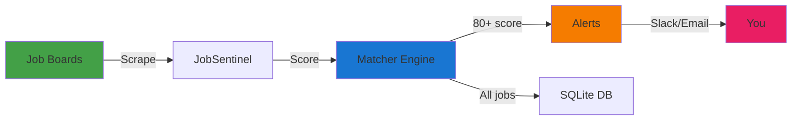

<div align="center">


# JobSentinel

### **Private job alerts on your machine**

Local-first job search automation • Smart scoring • Zero tracking • $0 forever

[](LICENSE)
[](https://www.python.org/)
[](#)
[](https://react.dev/)

[](https://github.com/cboyd0319/JobSentinel/actions/workflows/ci.yml)
[](https://github.com/cboyd0319/JobSentinel/actions/workflows/coverage.yml)
[](https://codecov.io/github/cboyd0319/JobSentinel)
[](https://github.com/cboyd0319/JobSentinel/actions/workflows/codeql.yml)
[](https://github.com/cboyd0319/JobSentinel/actions/workflows/scorecard.yml)

[Quickstart](#-quickstart) •
[Features](#-features) •
[Documentation](docs/DOCUMENTATION_INDEX.md) •
[Wiki](wiki/Home.md)

</div>

---

## What is JobSentinel?

**The problem:** Job boards are noisy, privacy-invasive, and require manual filtering. Paid services charge monthly fees ($30-100/mo), sell your data, and still miss the best opportunities.

**The solution:** JobSentinel runs 100% locally on your machine. It scrapes top job boards, scores matches against your preferences, and sends high-value alerts (80+ score) to Slack or email—all while keeping your data private. **No tracking. No subscriptions. $0 forever.**

### Who is this for?

- **Job seekers** who value privacy and want automated alerts for high-match roles
- **Passive candidates** monitoring the market without broadcasting availability
- **Recruiters** tracking positions for clients (GDPR/HIPAA compliant)
- **Developers** who want local-first automation without cloud dependencies

### What's New

- **React 19 + Vite 7** modern web UI with real-time updates
- **Platform installers** one-click setup for Windows and macOS
- **WCAG 2.1 AA** accessibility compliance
- **Resume analyzer** AI-powered job-resume matching
- **Application tracker** manage your job search pipeline
- **Dark mode** eye-friendly interface

---

## Quickstart

### Option 1: Windows (One-Click Install)

1. Download: https://github.com/cboyd0319/JobSentinel/archive/refs/heads/main.zip
2. Extract to Desktop
3. Double-click: `deploy/local/windows/launch-gui.bat`

**Done!** A GUI opens. Click "Start JobSentinel" and view logs in the interface.

### Option 2: macOS (5-Minute Wizard)

1. Download: https://github.com/cboyd0319/JobSentinel/archive/refs/heads/main.zip
2. Extract to Desktop
3. Double-click: `deploy/local/macos/setup-macos.sh`
   - If blocked: Right-click → Open → Open

Follow the interactive wizard to configure your preferences.

### Option 3: Linux/Command Line

```bash
# Clone repository
git clone https://github.com/cboyd0319/JobSentinel
cd JobSentinel

# Create virtual environment
python3 -m venv .venv && source .venv/bin/activate

# Install dependencies
pip install -e .
playwright install chromium

# Configure preferences
cp deploy/common/config/user_prefs.example.json deploy/common/config/user_prefs.json
# Edit config with your keywords, locations, salary, etc.

# Run single scan
python -m jsa.cli run-once

# Or start daemon (every 2 hours)
python -m jsa.cli run-daemon --interval 7200

# Or launch web UI
python -m jsa.cli web --port 8000
# Open: http://localhost:8000
```

**First time using a terminal?** → [Quickstart Guide](docs/QUICKSTART.md)

---

## How It Works



### Workflow

1. **Scrape** - Pull jobs from Greenhouse, Lever, Reed, JobsWithGPT, JobSpy
2. **Normalize** - Convert to standard format (source, title, company, location, salary, URL)
3. **Score** - Match against preferences (skills 40%, salary 25%, location 20%, company 10%, recency 5%)
4. **Alert** - Send high matches (80+ score) via Slack/email
5. **Store** - Save to local SQLite database (`data/jobs.sqlite`)

**Privacy-first:** All data stays on your machine. No telemetry. No external API calls (except job board scraping).

---

## Features

<table>
<tr>
<td width="50%">

**Job Scraping**
- **Multiple sources**: Greenhouse, Lever, Reed, JobsWithGPT, JobSpy
- **Auto-detection** of job board types
- **Rate limiting** respects robots.txt
- **Deduplication** across sources
- **Incremental updates** (only fetch new jobs)

**Smart Scoring**
- **Multi-factor scoring**:
  - Skills match: 40%
  - Salary range: 25%
  - Location: 20%
  - Company preferences: 10%
  - Recency: 5%
- **Keyword matching** (weighted by importance)
- **Deny list** (exclude companies/titles)
- **Salary filtering** (min/max ranges)

**Web UI** (NEW)
- **Dashboard** with job statistics
- **Search & filter** by source, date, score
- **Application tracker** manage pipeline
- **Resume analyzer** AI-powered matching
- **Real-time updates** via WebSocket
- **Dark mode** support
- **WCAG 2.1 AA** accessibility

</td>
<td width="50%">

**Alerts & Notifications**
- **Slack integration** (incoming webhooks)
- **Email notifications** (SMTP)
- **Threshold filtering** (only high scores)
- **Batching** (daily/weekly digests)
- **Rich formatting** (job details, links, scores)

**Data Storage**
- **SQLite database** (~50MB per 1000 jobs)
- **Full job history** (never lose opportunities)
- **Search queries** saved for re-runs
- **Export to CSV** for analysis
- **Privacy-first** (local-only, no cloud)

**Security & Privacy**
- **Local-first** - All data on your machine
- **No telemetry** - Zero tracking
- **OWASP ASVS Level 2** compliant (17 controls)
- **Secrets in .env** - Never hardcoded
- **Read-only scrapers** - Don't post to job boards
- **Input validation** - All external data validated

**Platform Support**
- **Windows** 11+ (one-click installer)
- **macOS** 15+ (interactive wizard)
- **Linux** (Ubuntu, Debian, Fedora)
- **Docker** (containerized deployment)
- **Python** 3.12+ required

</td>
</tr>
</table>

---

## Installation

### Prerequisites

<table>
  <thead>
    <tr>
      <th>Tool</th>
      <th>Version</th>
      <th>Purpose</th>
      <th>Required</th>
    </tr>
  </thead>
  <tbody>
    <tr>
      <td><strong>Python</strong></td>
      <td>≥ 3.12</td>
      <td>Runtime (includes SQLite)</td>
      <td>Yes</td>
    </tr>
    <tr>
      <td><strong>Git</strong></td>
      <td>any</td>
      <td>Clone repository (or download ZIP)</td>
      <td>No</td>
    </tr>
    <tr>
      <td><strong>Disk Space</strong></td>
      <td>1GB</td>
      <td>App + ML models + job data</td>
      <td>Yes</td>
    </tr>
    <tr>
      <td><strong>Slack Webhook</strong></td>
      <td>N/A</td>
      <td>Alerts (optional)</td>
      <td>No</td>
    </tr>
    <tr>
      <td><strong>Reed API Key</strong></td>
      <td>N/A</td>
      <td>UK jobs (optional)</td>
      <td>No</td>
    </tr>
  </tbody>
</table>

### Installation Guide

See [Quickstart Guide](docs/QUICKSTART.md) for detailed instructions.

---

## Configuration

Edit `deploy/common/config/user_prefs.json`:

```json
{
  "keywords": ["python", "backend", "api"],
  "locations": ["Remote", "San Francisco"],
  "min_salary": 120000,
  "denied_companies": ["Meta", "Amazon"],
  "job_sources": {
    "jobswithgpt": {"enabled": true},
    "reed": {"enabled": false, "api_key": ""}
  },
  "alerts": {
    "slack": {
      "enabled": false,
      "webhook_url": ""
    },
    "email": {
      "enabled": false,
      "smtp_host": "smtp.gmail.com",
      "smtp_port": 587,
      "from_email": "",
      "password": ""
    }
  }
}
```

### Key Configuration Options

<table>
  <thead>
    <tr>
      <th>Key</th>
      <th>Type</th>
      <th>Default</th>
      <th>Example</th>
    </tr>
  </thead>
  <tbody>
    <tr>
      <td><code>keywords</code></td>
      <td>list[str]</td>
      <td>[]</td>
      <td>["python", "backend"]</td>
    </tr>
    <tr>
      <td><code>locations</code></td>
      <td>list[str]</td>
      <td>[]</td>
      <td>["Remote", "SF"]</td>
    </tr>
    <tr>
      <td><code>min_salary</code></td>
      <td>int</td>
      <td>0</td>
      <td>120000</td>
    </tr>
    <tr>
      <td><code>denied_companies</code></td>
      <td>list[str]</td>
      <td>[]</td>
      <td>["Meta", "Amazon"]</td>
    </tr>
  </tbody>
</table>

Validate config:
```bash
python -m jsa.cli config-validate
```

---

## Usage

### Command Line

```bash
# Single scan
python -m jsa.cli run-once

# Daemon (every 2 hours)
python -m jsa.cli run-daemon --interval 7200

# Web UI
python -m jsa.cli web --port 8000

# Health check
python -m jsa.cli health
```

### Web UI

1. Start web server: `python -m jsa.cli web --port 8000`
2. Open browser: `http://localhost:8000`

**Features:**
- Dashboard with job statistics
- Search and filter jobs
- Application tracker
- Resume analyzer (AI-powered)
- Real-time updates (WebSocket)
- Dark mode support
- WCAG 2.1 AA accessibility

---

## Troubleshooting

### Top 5 Issues

<details>
<summary><strong>Error: Python not found</strong></summary>

**Cause:** Python 3.12+ not installed

**Fix:**

```bash
# Check version
python --version  # Need 3.12+

# Install:
# Windows: python.org
# macOS: brew install python@3.12
# Linux: apt install python3.12
```

</details>

<details>
<summary><strong>Error: Config not found</strong></summary>

**Cause:** Missing user_prefs.json

**Fix:**

```bash
cp deploy/common/config/user_prefs.example.json deploy/common/config/user_prefs.json
```

</details>

<details>
<summary><strong>No jobs found</strong></summary>

**Cause:** Keywords too specific, salary too high, or sources disabled

**Fix:**
- Broaden keywords (e.g., "engineer" instead of "senior staff principal engineer")
- Lower minimum salary threshold
- Check enabled sources: `python -m jsa.cli config-validate`

</details>

<details>
<summary><strong>Slack alerts not working</strong></summary>

**Cause:** Invalid webhook URL or Slack app misconfigured

**Fix:**

```bash
# Test webhook
curl -X POST "YOUR_WEBHOOK" \
  -H "Content-Type: application/json" \
  -d '{"text":"Test"}'

# Verify webhook in config
cat deploy/common/config/user_prefs.json | grep webhook_url
```

</details>

<details>
<summary><strong>Database locked error</strong></summary>

**Cause:** Multiple JobSentinel processes running

**Fix:**

```bash
# Find and kill processes
ps aux | grep jobsentinel
kill <PID>

# Or restart system
```

</details>

**More help:** [Troubleshooting Guide](docs/TROUBLESHOOTING.md) • [GitHub Discussions](https://github.com/cboyd0319/JobSentinel/discussions)

---

## Performance

**Expected performance:**
- Scrape time: 30–60s per source
- Scoring: <5s per 100 jobs
- Alert latency: <10s (Slack/email)
- Memory usage: <500MB (includes ML models)
- Disk usage: ~50MB per 1000 jobs
- Database: SQLite (<100MB typical)

**Tested with:** 10,000+ jobs in SQLite without performance degradation.

---

## Roadmap

### v0.9.0 (Current)
- React 19 + Vite 7 UI
- Consolidated documentation
- Platform installers (Windows/macOS)
- WCAG 2.1 AA accessibility

### v1.0 (Q1 2026)
- GPT-4 integration (optional, cost-controlled)
- Multi-language support
- Browser extension
- Mobile companion app

See [AI/ML Roadmap](docs/reference/AI_ML_ROADMAP.md) for AI/ML features.

---

## Documentation

### Getting Started
- **[Quickstart Guide](docs/QUICKSTART.md)** - Detailed setup instructions
- **[Documentation Index](docs/DOCUMENTATION_INDEX.md)** - Complete documentation map
- **[Wiki](wiki/Home.md)** - Capabilities and features

### Architecture & Design
- **[Architecture](docs/ARCHITECTURE.md)** - System design and data flow
- **[Security](SECURITY.md)** - Security model and threat analysis

### Operations
- **[Troubleshooting](docs/TROUBLESHOOTING.md)** - Common issues and fixes
- **[Contributing](CONTRIBUTING.md)** - Development setup

---

## Contributing

Contributions welcome! See [CONTRIBUTING.md](CONTRIBUTING.md).

**Before submitting:**
- Tests pass: `make test`
- Lint passes: `make lint`
- Type check passes: `make type`
- Coverage ≥85%: `make cov`
- No secrets committed

**Quick start for developers:**
```bash
git clone https://github.com/cboyd0319/JobSentinel
cd JobSentinel
make dev  # Install dev dependencies
make test  # Run tests
```

---

## License

**MIT License** - See [LICENSE](LICENSE) for full text.

```
✅ Commercial use allowed
✅ Modification allowed
✅ Distribution allowed
✅ Private use allowed
📋 License and copyright notice required
```

**TL;DR:** Use it however you want. Just include the license.

Learn more: https://choosealicense.com/licenses/mit/

---

## Support & Community

**Need help?**
- 🐛 [File a bug report](https://github.com/cboyd0319/JobSentinel/issues/new?template=bug_report.md)
- 💡 [Request a feature](https://github.com/cboyd0319/JobSentinel/discussions/new?category=feature-requests)
- 💬 [Ask a question](https://github.com/cboyd0319/JobSentinel/discussions/new?category=q-a)
- 🔒 [Report a security issue](SECURITY.md) (private)

**Resources:**
- [Wiki](wiki/Home.md) - Comprehensive capabilities and features
- [Documentation](docs/DOCUMENTATION_INDEX.md) - Complete docs
- [Security Policy](SECURITY.md) - Responsible disclosure

### Support Policy

This is a single-developer, personal project. Support is best-effort with no SLAs.
Security issues are prioritized; feature requests and questions are handled as time allows.

---

<div align="center">

## ⭐ Spread the Word

If JobSentinel helps you find your next opportunity, **give us a star** ⭐

[](https://github.com/cboyd0319/JobSentinel/stargazers)

**Active Development** • **Privacy-First** • **Community-Driven**

Made with ❤️ for job seekers who value privacy

[⬆ Back to top](#jobsentinel)

</div>
