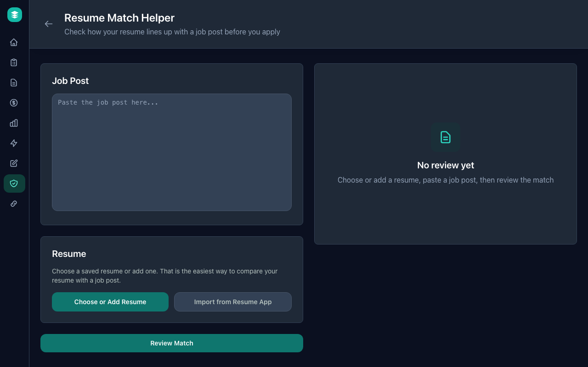
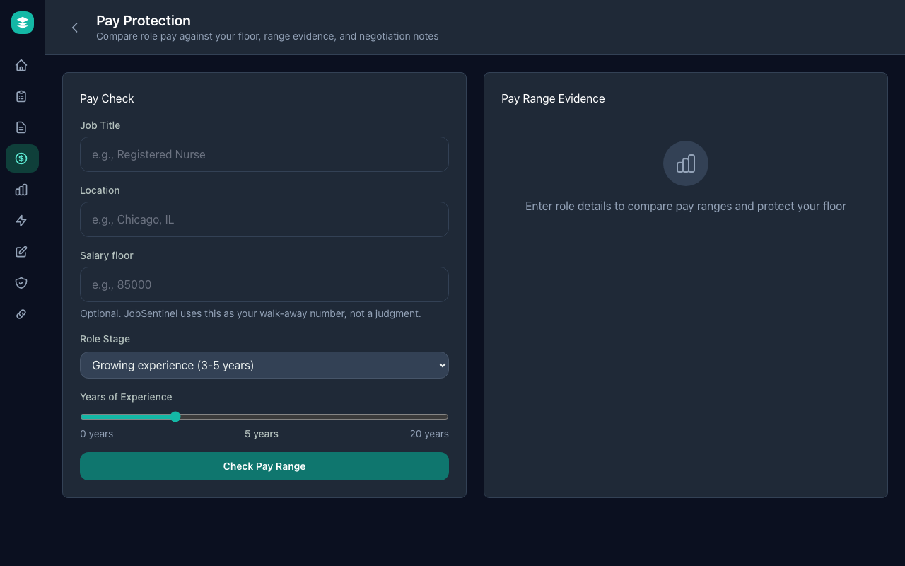
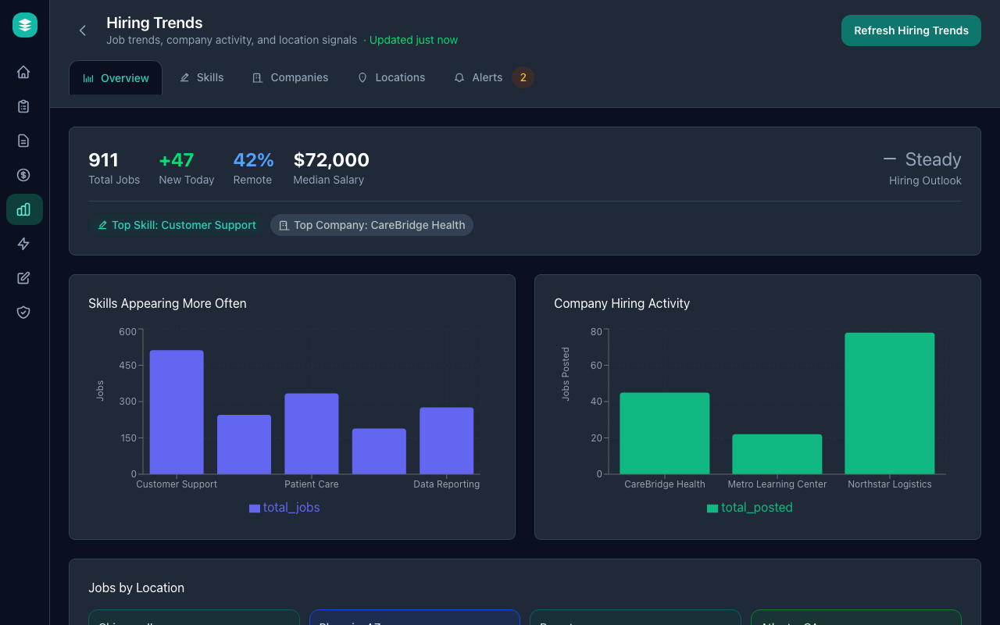

# JobSentinel

**JobSentinel is a free, open-source, local-first desktop assistant for finding
real, relevant, fairly compensated work while keeping job-search data under the
user's control.**

JobSentinel is an open-source, local-first job-search assistant for finding real,
relevant, fairly compensated work while keeping sensitive job-search data under user
control.

Find better roles, spot weak postings, tailor truthful resumes, track every
application, and protect your pay goals from one private desktop workspace.
Core workflows work locally. JobSentinel is free, will always stay free, and
will always remain MIT licensed.

[](https://github.com/cboyd0319/JobSentinel/actions/workflows/ci.yml)
[](https://github.com/cboyd0319/JobSentinel/releases/latest)
[](LICENSE)
[](PRIVACY.md)
[](PRIVACY.md)
[](docs/architecture/privacy-first-ai-gateway.md)

**Start here:** [Download](#download) |
[Capabilities](docs/features/capabilities.md) |
[Quick start](docs/user/QUICK_START.md) |
[Privacy](PRIVACY.md) |
[Research](docs/research/README.md) |
[Contribute](docs/developer/CONTRIBUTING.md)

<p align="center">
  
  <br>
  <em>Local dashboard with job matches, posting-risk cues, filters, source status, and dark mode.</em>
</p>

## What It Helps With

JobSentinel is for job seekers, not hiring teams. It is designed for technical
and non-technical roles, career changes, long searches, and people who should
not need terminal commands or debugging skill to get value.

## The Short Version

| Flow | What JobSentinel makes easier |
| --- | --- |
| **Find** | Search approved sources, employer career pages, regional boards, and user-opened job sites from one local workspace. |
| **Judge** | See fit, freshness, source trust, pay transparency, reposting clues, and likely ghost-job signals before spending time. |
| **Prepare** | Match resumes to real requirements, catch hard gaps, improve readability, and draft only claims the user can support. |
| **Apply** | Review forms, screening questions, attachments, notes, reminders, and follow-ups without letting the tool submit for you. |
| **Negotiate** | Keep salary floors, written offers, verbal numbers, total compensation, commute, relocation, and deadlines in view. |

| Need | JobSentinel response |
| --- | --- |
| Find jobs without losing control | Check approved sources, open search links, import visible jobs, and keep a local job board. |
| Avoid stale or low-trust postings | Review source, freshness, reposting, pay, and ghost-job signals before spending time tailoring. |
| Track applications cleanly | Save jobs, notes, contacts, reminders, interviews, offers, and no-response follow-up. |
| Improve resumes truthfully | Build resumes, review readable text, compare against jobs, and draft evidence-bounded improvements. |
| Protect pay goals | Set salary floors, compare listed pay, review written offers, and prepare local counter or decline notes. |
| Keep data private | Store search data locally by default, with no telemetry and no hosted account requirement. |

## What Makes It Different

- **Ghost-job review is built in.** JobSentinel looks for stale, reposted,
  weak-source, scam-like, and low-confidence signals so users can decide where
  their effort is worth spending.
- **Source discovery understands the messy job web.** It can classify public
  feeds, employer career pages, regional boards, ATS-backed postings,
  user-opened search destinations, and restricted sign-in sources.
- **Resume help stays evidence-bound.** It can help a user clarify real
  experience, improve readability, and map resume evidence to job requirements
  without fabricating qualifications.
- **Restricted-source work is user-driven.** LinkedIn-style workflows are built
  around user-opened sessions, visible-job import, local review, clear warnings,
  and no session-token storage.
- **Pay protection is a core workflow.** Salary floors, listed ranges,
  written-vs-verbal offers, total compensation, commute costs, relocation, and
  pressure deadlines are treated as first-class job-search data.
- **Local match intelligence goes beyond keywords.** Embedded builds can use
  governed Qwen3-Embedding-0.6B retrieval plus Qwen3-Reranker-0.6B reranking,
  combined with exact skill, BM25, seniority, blocker, and evidence signals.
- **Security is part of the product mechanics.** Safe support reports, local
  encrypted secrets, optional AI request previews, and release artifact
  checksums are built into normal flows instead of bolted on later.
- **Agent Skills ship with the app.** The release includes downloadable job
  hunting and resume skills for agents that support skills packages.
- **External AI is optional, not the product.** Users can configure providers,
  preview payloads, approve requests, and keep the local path available.

## Download

Use the [latest GitHub release](https://github.com/cboyd0319/JobSentinel/releases/latest)
and verify the matching `.sha256` checksum from the same release before opening
a package or installer.

| Platform | What to use |
| --- | --- |
| Windows 11+ | Use the `.msi` or setup `.exe`. If the filename includes `_unsigned`, expect SmartScreen and verify the checksum first. |
| macOS | Use the `_no-account_universal.dmg` for Apple silicon and Intel Macs. Until Apple Developer Program materials are available, the package is not Developer ID signed and not notarized, and may require first-open Privacy & Security approval. |
| Linux | Use the `.AppImage` or `.deb` when present for the release. |
| Agent Skills | Download the Agent Skills ZIP on Windows, or ZIP/tar.gz on macOS and Linux, then verify the matching checksum. |

JobSentinel does not silently update itself in `2.9.1`. Back up Settings before
replacing the app, then install the newer release. See
[Updating Or Going Back](docs/user/UPDATES.md).

Agent Skills downloads are separate from the desktop installer. Release assets
include `JobSentinel-X.Y.Z-agent-skills.tar.gz` and
`JobSentinel-X.Y.Z-agent-skills.zip` with matching `.sha256` checksums.
Use the ZIP archive on Windows. It is the most portable extraction path.

<details>
<summary><strong>First-open prompts</strong></summary>
<br>

macOS can show:

```text
JobSentinel can't be opened because Apple cannot check it for malicious software.
```

Continue only if you downloaded JobSentinel from the release page above,
expected this file, and verified the `.dmg` with the matching `.dmg.sha256`
from the same release. If you cannot verify it, delete the download and wait for
a replacement package or build locally.

Windows SmartScreen can show:

```text
Windows protected your PC
```

Continue only if the file came from the release page above and the checksum
matches. Unsigned Windows files must be clearly labeled `_unsigned`.

</details>

## Why Trust It

**Rule 0: user privacy and security are non-negotiable.** No feature,
integration, support shortcut, external AI provider, source adapter, or test
fixture may weaken local control, credential safety, explicit review, or
privacy-preserving defaults.

| Boundary | Commitment |
| --- | --- |
| Local-first data | Searches, saved jobs, notes, resumes, salary floors, applications, and support reports stay local by default. |
| No telemetry | JobSentinel does not collect analytics or behavioral telemetry. |
| External AI | Optional, disabled by default, preview-gated, and routed through the privacy-first AI gateway. |
| Secrets | Alert credentials and source access codes use the local encrypted vault and OS credential store where available. |
| Applications | JobSentinel helps prepare and track applications, but the user reviews and submits outside JobSentinel. |
| Restricted sources | User-gated, warning-backed, local, and review-first. JobSentinel does not store restricted-site cookies, tokens, browser storage, or auth headers. |

**Current macOS full-public-readiness: 94%; no-account path completion: 100%.**
A zero-friction Mac release still requires Apple Developer Program materials,
Developer ID signing, notarization, stapling, and Gatekeeper acceptance.

External AI, including OpenAI or another provider, is optional, disabled by
default, and routed through the
[privacy-first AI gateway](docs/architecture/privacy-first-ai-gateway.md).
External requests send only needed details, show those details before anything
leaves the device, and provide redaction, cancellation, approval, and local
request logging.

Read more in [PRIVACY.md](PRIVACY.md),
[RESPONSIBLE_AI.md](RESPONSIBLE_AI.md), and the
[security docs](docs/security/README.md).

## What Is New In v2.9.1

v2.9.1 is a maintenance and repo cleanup release. It keeps the v2.9.0 user
features intact while refreshing stable dependencies and shrinking oversized
maintenance surfaces.

## What Was New In 2.9.0

- Browser Import review queue for visible jobs the user chooses to send into
  JobSentinel before saving.
- LinkedIn-compatible Workbench model for user-opened sessions, local ledger
  actions, visible-card import, and explicit restricted-source acknowledgement
  without cookie, token, storage, auth-header, or hidden-page capture.
- Broader job-source taxonomy for public APIs, public employer pages, regional
  boards, restricted public boards, authenticated sources, and no-account limits.
- Resume Builder, Resume Match, hard-requirement review, ATS/readability
  guidance, evidence-bounded bullet drafting, and JSON Resume import/export.
- Local semantic matching architecture with governed Qwen3 embeddings,
  bounded Qwen3 reranking, hybrid skill/BM25 scoring, deterministic fallback,
  and privacy-safe diagnostics.
- Application Assist for review-first form guidance, screening-answer review,
  cover-letter checks, and manual final submission.
- Pay Protection for listed-pay gaps, written-vs-verbal offers,
  commute/relocation review, deadline pressure, and local counter/decline notes.
- Downloadable Agent Skills for job-search planning, posting-risk review,
  resume tailoring, application review, tracking, outreach, interview prep, and
  offer/pay review.
- Optional external AI provider configuration for OpenAI, Anthropic, Google
  Gemini, GitHub Copilot, and custom HTTPS providers through the local gateway.

Full notes: [docs/releases/v2.9.0.md](docs/releases/v2.9.0.md).

## Job Source Terms And User Control

JobSentinel does not encourage, endorse, or hide violations of any job site's
terms. The safe default path is official feeds, public employer career pages,
user-opened search links, manual entry, and single-job imports the user reviews
before saving.

Some sites say third-party software that scrapes, modifies, or automates
activity can violate their terms, lead to account restrictions, or raise legal
and privacy concerns. JobSentinel makes that risk clear before restricted-source
actions. Users must explicitly accept the warning before those actions continue.

Restricted-source sessions stay user-driven:

- No hidden background access.
- No stored login details, cookies, browser storage, tokens, or auth headers.
- No CAPTCHA solving or bypass of platform controls.
- No resale, republication, or bulk redistribution of job-board data.
- No automatic final application submission.

Public unauthenticated sources can be lower-friction when their access pattern
allows it, but they still use respectful request pacing, safe errors, and local
review. See [Job Sources](docs/features/job-sources.md).

## Core Capabilities

| Area | Capability |
| --- | --- |
| Job discovery | Approved public source checks, public employer pages, user-opened search links, Browser Import, and manual entries. |
| Source intelligence | Source status, duplicate cleanup, public API and ATS classification, and restricted-source boundaries. |
| Job review | Fit, freshness, pay transparency, ghost-job cues, source risk, and next actions. |
| Resumes | Resume library, builder, PDF/DOCX/JSON Resume export, ATS/readability review, and match review. |
| Applications | Application board, notes, contacts, reminders, interviews, offers, no-response review, and Application Assist. |
| Pay | Salary floors, listed-pay review, total compensation prompts, written-offer separation, and negotiation notes. |
| Local matching | Optional Qwen3 embedding plus reranker pipeline with exact skill, BM25, blocker, seniority, and evidence signals. |
| Alerts | Desktop notifications plus optional email, Slack, Discord, Teams, and Telegram after setup. |
| AI | Optional provider gateway with preview, approval, redaction, cancellation, and metadata-only local logs. |
| Skills | Downloadable Agent Skills packages for job hunting and resume workflows. |

For the full maintained list, use
[Features And Capabilities](docs/features/capabilities.md).

## Under The Hood

JobSentinel is more than a spreadsheet with job cards. The release includes
several local-first mechanics that make the app useful without turning the user
into a system administrator.

| Mechanic | Why it matters |
| --- | --- |
| Local Qwen3 match intelligence | Compares jobs and resumes with semantic retrieval, reranking, exact skills, blockers, and evidence instead of only keyword counts. |
| Source taxonomy and routing | Separates official feeds, employer career pages, ATS families, regional boards, public boards, restricted sources, and manual paths. |
| Restricted-source Workbench | Lets users work from sign-in-backed sites through visible, user-started sessions without storing cookies, tokens, browser storage, or hidden page state. |
| Evidence-bounded resume help | Connects job requirements to real resume passages, readability issues, hard gaps, and truthful draft improvements. |
| Pay and offer protection | Keeps salary floors, listed ranges, written offers, verbal numbers, commute, relocation, and deadline pressure in one review flow. |
| Privacy-first AI gateway | Lets users configure providers, preview payloads, redact or cancel, approve sends, and keep metadata-only local logs. |
| Local vault and safe reports | Stores saved secrets locally and creates sanitized support reports the user can review before sharing. |
| Downloadable Agent Skills | Packages job-search workflows as portable skills for compatible agent tools, with both ZIP and tar.gz release assets. |
| Release supply-chain checks | Publishes checksums, SBOMs, attestations, no-account labels, unsigned labels, and public asset verification. |

### Local Match Intelligence

JobSentinel's strongest resume/job matching path is local and inspectable. When
an embedded-ML build has verified model files, matching uses:

| Layer | What it does |
| --- | --- |
| Qwen3-Embedding-0.6B | Retrieves resume and job passages that are meaningfully related, not only exact keyword matches. |
| Exact skill and BM25 scoring | Keeps concrete tools, certifications, titles, and requirement words grounded. |
| Qwen3-Reranker-0.6B | Reranks a bounded top-K set so direct evidence beats keyword-only near misses. |
| Blockers and evidence classes | Flags missing hard requirements, salary/location mismatch, seniority mismatch, and weak evidence. |
| Model governance | `models.lock.toml` pins model identity, revisions, hashes, sizes, licenses, and instruction profiles. |

If local model files are not present, JobSentinel falls back to deterministic
matching. Resume and job text stays local either way. See
[Local Semantic Matching](docs/developer/LOCAL_SEMANTIC_MATCHING.md) and the
[semantic matching research notes](docs/research/semantic-resume-job-matching.md).

## Screenshots

<p align="center">
  
  <br>
  <em>Track applications from saved to offer, with notes and follow-up reminders.</em>
</p>

<details>
<summary><strong>More screenshots</strong></summary>
<br>

| Resume builder | Resume matcher |
| --- | --- |
|  |  |

| Hiring-system transparency | Application Assist |
| --- | --- |
|  |  |

| Pay Protection | Hiring Trends |
| --- | --- |
|  |  |

| Settings |
| --- |
|  |

</details>

## Architecture

JobSentinel is a desktop app, not a hosted job-search service.

```text
React 19 + TypeScript UI
  -> Tauri command boundary
  -> Rust 2021 services
  -> local SQLite database
  -> approved source checks and optional channels
```

| Boundary | Rule |
| --- | --- |
| Renderer to backend | UI calls typed Tauri commands and handles user-safe errors. |
| Storage | SQLite stores searches, saved jobs, notes, applications, resumes, reports, and local request logs. |
| Job-source checks | Approved sources only, with respectful pacing and clear errors. |
| External alerts | Work only after the user configures them. |
| External AI | Must go through the privacy-first AI gateway. Scattered provider calls are not allowed. |
| Research mode | Public postings and synthetic candidate profiles are the default evaluation data. |

Developer entrypoints:

- [Developer architecture](docs/developer/ARCHITECTURE.md)
- [Getting started](docs/developer/GETTING_STARTED.md)
- [Testing](docs/developer/TESTING.md)
- [Releasing](docs/developer/RELEASING.md)
- [Harness engineering](docs/harness/README.md)

## Build From Source

Requirements:

- Node.js 24.17.0 from `.nvmrc`
- npm 11.17.0 from `package.json`
- Rust 1.96.0 from `rust-toolchain.toml`
- Platform packages from [developer setup](docs/developer/GETTING_STARTED.md)

Current backend surface: **208 registered Tauri commands**.

```bash
git clone https://github.com/cboyd0319/JobSentinel
cd JobSentinel
node scripts/install-pinned-npm.mjs
npm ci --ignore-scripts
npm run tauri:build
```

Common verification:

```bash
npm run harness:check
npm run lint:bloat
npm run lint:docs
npm run lint
npm run test:run
npm run test:e2e:smoke
npm run build
cd src-tauri && cargo fmt --all -- --check
cd src-tauri && cargo clippy -- -D warnings
cd src-tauri && cargo test --lib
```

Release verification is broader. Use
[docs/harness/verification-matrix.md](docs/harness/verification-matrix.md).

## Support

The easiest support path starts inside JobSentinel:

1. Open **Settings**.
2. Choose **Save Safe Support Report** or **Copy Safe Support Report**.
3. Review the report.
4. Share it only if you want help.

GitHub is optional. If you already use it, open the
[help page](https://github.com/cboyd0319/JobSentinel/issues/new) or start a
[discussion](https://github.com/cboyd0319/JobSentinel/discussions).

## Project Map

| Need | Link |
| --- | --- |
| First install and setup | [Quick Start](docs/user/QUICK_START.md) |
| Full capability list | [Features And Capabilities](docs/features/capabilities.md) |
| Update or roll back | [Updating Or Going Back](docs/user/UPDATES.md) |
| Privacy and data boundaries | [PRIVACY.md](PRIVACY.md) |
| Responsible AI | [RESPONSIBLE_AI.md](RESPONSIBLE_AI.md) |
| Research notes | [docs/research](docs/research/README.md) |
| Roadmap | [ROADMAP.md](ROADMAP.md) |
| Changelog | [CHANGELOG.md](CHANGELOG.md) |
| External references | [docs/references.md](docs/references.md) |

## References and external sources

The complete reference index lives in
[docs/references.md](docs/references.md).

<div align="center">

**Open source. Local-first. Built for job seekers who value privacy.**

[Download](#download)

</div>
