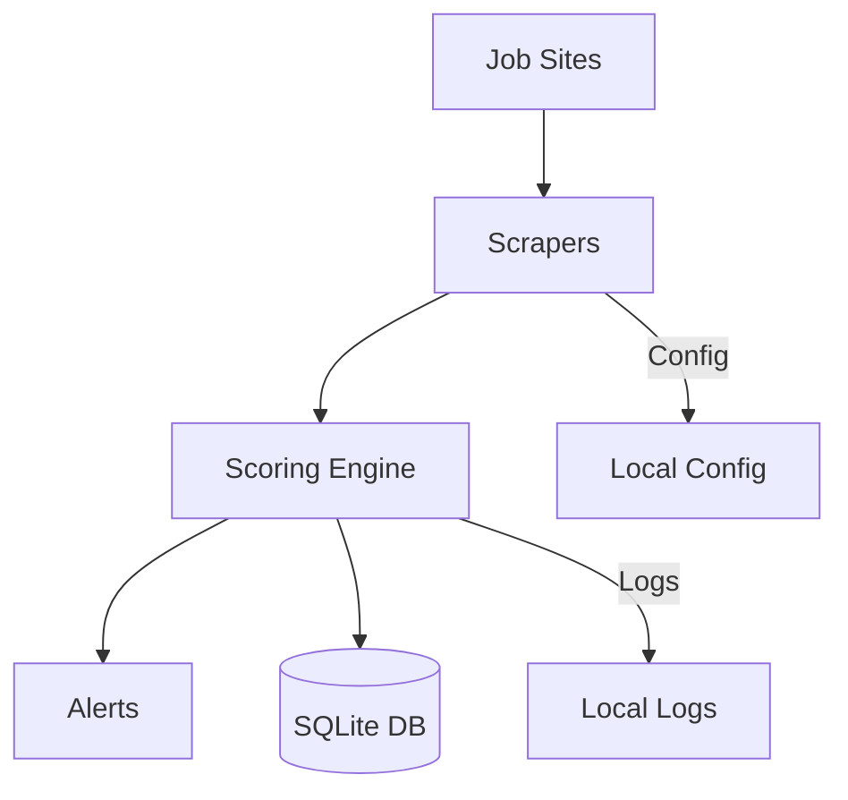
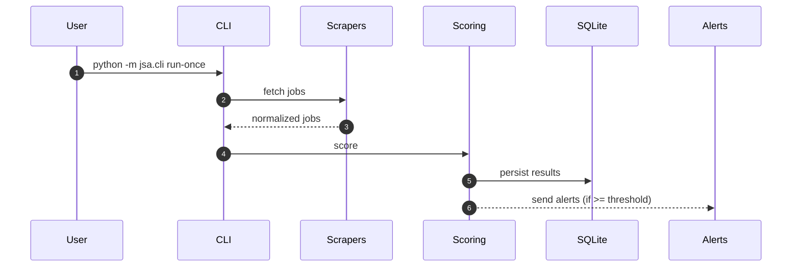

# Architecture

**Flow:** Scrapers fetch from public job boards → scoring engine filters by keywords/salary/location → high matches trigger Slack webhooks

**Data in/out:** HTML/JSON from job sites → normalized jobs in SQLite → Slack webhook POST

**Trust boundaries:** API keys in `.env`, no telemetry, all storage local, scrapers read-only

## Components

**Scrapers** (`sources/`)
- Greenhouse, Lever, Reed, JobsWithGPT, JobSpy
- Respect robots.txt, rate limits (exponential backoff)
- Return normalized job objects (source, title, company, location, salary, URL, posted_at)

**Scoring** (`matchers/`)
- Multi-factor: skills 40%, salary 25%, location 20%, company 10%, recency 5%
- Configurable weights in `config/user_prefs.json`
- Scam detection: FBI IC3 + FTC + BBB patterns

**Alerts** (`notify/`)
- Slack incoming webhook (POST with job details)
- Rate limiting to avoid hitting Slack limits

**Storage** (`models/`, SQLite)
- Jobs table: dedupe on (source, source_job_id)
- Scores table: job_id foreign key, factor breakdown
- ~1-5 MB per 1k jobs

**Web UI** (`src/jsa/web/`, Flask)
- Optional interface for config, job review, manual triggers
- WCAG 2.2 AA compliant
- Runs on `python -m jsa.cli web --port 5000`

**CLI** (`src/jsa/cli.py`)
- `run-once` — single scrape session
- `config-validate` — check config syntax
- `web` — start Flask dev server

## Sequence: run-once (Mermaid)

## Code structure

**Typed core** (`src/jsa/`)
- `jsa.web.app` — Flask app factory
- `jsa.config` — typed config facade
- `jsa.logging` — structured JSON logs
- `jsa.db` — typed database facade

**Legacy** (top-level dirs)
- `sources/`, `matchers/`, `notify/`, `models/`, `utils/`
- Gradually migrating to `src/jsa/`

## Quality gates

- `make fmt` — Black format
- `make lint` — Ruff check
- `make type` — mypy strict on `src/jsa/`
- `make test` — pytest
- `make cov` — 85% minimum coverage
