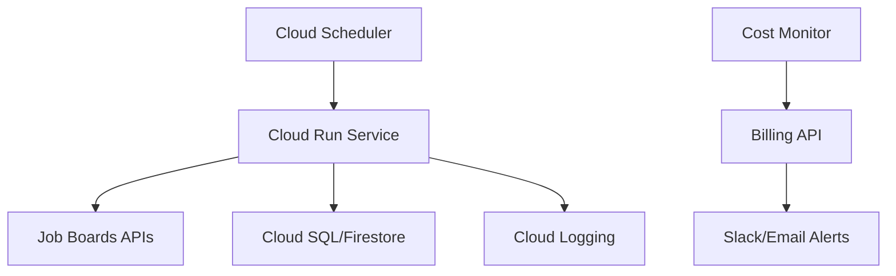
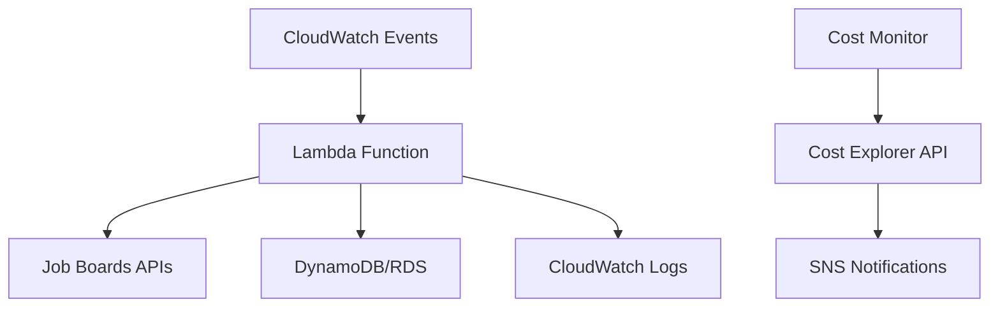
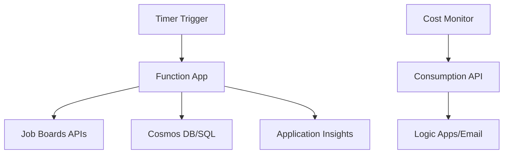

# Complete Cloud Deployment Guide

This comprehensive guide covers deploying the Job Private Scraper & Filter to cloud platforms with enterprise-grade cost protection and monitoring.

## Overview

The job scraper supports deployment to three major cloud platforms with built-in cost protection, security hardening, and automated monitoring:

- **Google Cloud Platform (GCP)** - Cloud Run (Recommended)
- **Amazon Web Services (AWS)** - Lambda Functions
- **Microsoft Azure** - Azure Functions

## Quick Start

### One-Command Deployment

```bash
# Google Cloud Run (recommended, best free tier)
python -m cloud.bootstrap --provider gcp

# AWS Lambda
curl -fsSL https://raw.githubusercontent.com/cboyd0319/job-private-scraper-filter/main/scripts/install.sh | bash -s -- --cloud-deploy aws

# Azure Functions
curl -fsSL https://raw.githubusercontent.com/cboyd0319/job-private-scraper-filter/main/scripts/install.sh | bash -s -- --cloud-deploy azure
```

### Enhanced Deployment Workflow

For more control and validation:

```bash
# 1. Clone the repository
git clone https://github.com/cboyd0319/job-private-scraper-filter.git
cd job-private-scraper-filter

# 1a. Automated provisioning
python -m cloud.bootstrap --provider gcp

# 2. Validate deployment readiness
scripts/validate-cloud-config.sh gcp

# 3. Deploy with enhanced orchestrator
scripts/deploy-cloud.sh gcp

# 4. Monitor costs
scripts/enhanced-cost-monitor.py --provider gcp --check
```

## Prerequisites

### Required Tools

**For GCP:**
- No pre-installed tools required — `python -m cloud.bootstrap --provider gcp` installs the Cloud SDK during setup
- Billing account with alerts configured (script guides the confirmation step)

**For AWS:**
- `aws` CLI authenticated and configured
- `sam` CLI for serverless deployment
- Docker installed and running

**For Azure:**
- `az` CLI authenticated and configured
- `func` CLI for Azure Functions
- Docker installed and running

### Cost Protection Setup (CRITICAL)

⚠️ **BEFORE deploying to ANY cloud provider, you MUST set up cost protections:**

1. **Billing Alerts**
   - GCP: $5 threshold
   - AWS: $10 threshold
   - Azure: $15 threshold

2. **Spending Limits**
   - Set account-level spending limits
   - Configure auto-stop at 80% of budget

3. **Resource Quotas**
   - Maximum 1 instance/function
   - 512MB memory limit
   - 15-minute timeout

4. **Monitoring**
   - Daily cost reports
   - Alert notifications via Slack/email

## Cost Analysis & Projections

### Monthly Cost Estimates

| Provider | Free Tier | Light Usage | Heavy Usage |
|----------|-----------|-------------|-------------|
| **GCP Cloud Run** | $0 | $1-3 | $5-10 |
| **AWS Lambda** | $0 | $2-5 | $8-15 |
| **Azure Functions** | $0* | $3-8 | $10-20 |

*Azure: First 12 months only

### Typical Usage Patterns

**Light Usage (Personal):**
- 96 executions/day (every 15 minutes)
- ~2,880 executions/month
- 50-100 job postings scanned/day
- Well within all free tiers

**Heavy Usage (Multiple Companies):**
- Same execution frequency
- 500+ job postings scanned/day
- May exceed free tier limits

## Deployment Architecture

### Google Cloud Run (Recommended)

### Automated Cloud Run bootstrap (script overview)

`python -m cloud.bootstrap --provider gcp` performs the following in sequence:

- Installs the Google Cloud SDK if it is missing
- Creates a dedicated project with billing linked
- Enables Cloud Run, Cloud Build, Secret Manager, Cloud Scheduler, Artifact Registry, Pub/Sub, and Monitoring APIs
- Builds the container image via Cloud Build and stores it in Artifact Registry
- Stores `.env` values and `user_prefs.json` inside Secret Manager
- Creates least-privilege service accounts for Cloud Run and Cloud Scheduler
- Deploys a Cloud Run Job that executes `python src/agent.py --mode poll`
- Creates a Cloud Scheduler job that triggers the Cloud Run Job every 15 minutes using OIDC
- Configures a $5 USD budget guardrail via the Billing Budgets API

You can re-run the script at any time; it safely updates existing resources and only prompts for confirmation when manual steps are required.

Additional reference: Google’s official [Cloud Run sample applications](https://github.com/GoogleCloudPlatform/cloud-run-samples) showcase runtime patterns that align with this setup.




**Features:**
- Scales to zero (no idle costs)
- Built-in HTTPS/load balancing
- Automatic scaling
- Comprehensive logging

**Configuration:**
```yaml
# Generated automatically by deploy-cloud.sh
resources:
  limits:
    memory: 512Mi
    cpu: 1
scaling:
  maxInstances: 1
  minInstances: 0
timeout: 900s
```

### AWS Lambda



**Features:**
- Pay-per-execution model
- Native AWS service integration
- Comprehensive monitoring
- Auto-scaling

### Azure Functions



**Features:**
- Consumption-based pricing
- Integration with Office 365
- Built-in monitoring
- Azure ecosystem benefits

## Security Hardening

### Built-in Security Features

1. **Network Security**
   - HTTPS-only communication
   - VPC/subnet isolation (where applicable)
   - No public database access

2. **Identity & Access**
   - Least-privilege service accounts
   - No long-lived credentials
   - Managed identity for cloud resources

3. **Data Protection**
   - Encryption at rest and in transit
   - No secrets in code/containers
   - Environment variable injection

4. **Monitoring & Auditing**
   - All API calls logged
   - Security event alerting
   - Compliance reporting

### Security Validation

The deployment process includes automated security checks:

```bash
# Pre-deployment security validation
scripts/validate-cloud-config.sh gcp

# Post-deployment security scan
bandit -r . -x ./.venv --quiet

# Infrastructure security check
scripts/enhanced-cost-monitor.py --provider gcp --security-scan
```

## Cost Monitoring & Protection

### Automated Cost Protection

The enhanced cost monitor provides multi-layered protection:

1. **Real-time Monitoring**
   - Hourly cost checks
   - API-based cost retrieval
   - Trend analysis and forecasting

2. **Alert Thresholds**
   - 50%: Warning notification
   - 80%: Critical alert + service throttling
   - 90%: Emergency stop

3. **Automatic Actions**
   - **Throttling**: Reduce instance limits
   - **Emergency Stop**: Completely shut down services
   - **Notifications**: Slack/email alerts

### Cost Monitoring Commands

```bash
# Check current costs
scripts/enhanced-cost-monitor.py --provider gcp --check

# Generate detailed cost report
scripts/enhanced-cost-monitor.py --provider gcp --report

# Test alert notifications
scripts/enhanced-cost-monitor.py --provider gcp --test-alert warning

# Manual emergency stop
scripts/enhanced-cost-monitor.py --provider gcp --emergency-stop
```

### Cost Optimization Tips

1. **Scheduling Optimization**
   - Pause during weekends/holidays
   - Reduce frequency during low-activity periods
   - Use intelligent retry mechanisms

2. **Resource Right-sizing**
   - Monitor memory usage patterns
   - Adjust timeout values based on actual needs
   - Optimize cold start performance

3. **Data Management**
   - Regular cleanup of old data
   - Efficient database queries
   - Compressed logging

## Monitoring & Observability

### Built-in Dashboards

Each deployment includes monitoring setup:

**GCP (Cloud Monitoring):**
```bash
# View service metrics
gcloud monitoring dashboards list

# Check logs
gcloud logs tail job-scraper --limit=100
```

**AWS (CloudWatch):**
```bash
# View function metrics
aws logs describe-log-groups --log-group-name-prefix "/aws/lambda/job-scraper"

# Get cost data
aws ce get-cost-and-usage --time-period Start=2024-01-01,End=2024-02-01 --granularity MONTHLY --metrics BlendedCost
```

**Azure (Application Insights):**
```bash
# View function logs
az webapp log tail --name job-scraper-prod --resource-group job-scraper-rg

# Check costs
az consumption usage list --start-date 2024-01-01 --end-date 2024-02-01
```

### Custom Metrics

The application exports custom metrics:

- Job scraping success rate
- Response time per job board
- Cost per job discovered
- Alert response times

### Health Monitoring

```bash
# Application health check
python src/agent.py --mode health

# Infrastructure health (post-deployment)
scripts/validate-cloud-config.sh --post-deployment gcp

# End-to-end monitoring
scripts/deploy-cloud.sh --monitor gcp
```

## Troubleshooting

### Common Deployment Issues

**Authentication Errors:**
```bash
# GCP
gcloud auth login
gcloud config set project YOUR_PROJECT_ID

# AWS
aws configure
aws sts get-caller-identity

# Azure
az login
az account set --subscription YOUR_SUBSCRIPTION_ID
```

**Permission Issues:**
```bash
# Enable required APIs/services
# GCP
gcloud services enable run.googleapis.com cloudbuild.googleapis.com

# AWS
aws iam attach-user-policy --user-name YOUR_USER --policy-arn arn:aws:iam::aws:policy/PowerUserAccess

# Azure
az role assignment create --assignee YOUR_USER --role Contributor
```

**Resource Quota Issues:**
```bash
# Check quotas and request increases if needed
# GCP
gcloud compute project-info describe --format="table(quotas.metric,quotas.limit,quotas.usage)"

# AWS
aws service-quotas list-service-quotas --service-code lambda

# Azure
az vm list-usage --location eastus
```

### Performance Issues

**Cold Start Optimization:**
- Use smaller base images
- Minimize dependencies
- Implement connection pooling
- Pre-warm critical paths

**Memory Optimization:**
- Profile memory usage locally
- Adjust memory allocation based on actual usage
- Implement garbage collection strategies

**Network Optimization:**
- Use persistent connections
- Implement request batching
- Add retry logic with exponential backoff

### Cost Overruns

**Immediate Actions:**
```bash
# Emergency stop all services
scripts/enhanced-cost-monitor.py --provider gcp --emergency-stop

# Check current spend
scripts/enhanced-cost-monitor.py --provider gcp --report

# Review unusual activity
# Check logs for unexpected API calls or errors
```

**Investigation:**
- Review execution frequency
- Check for failed requests causing retries
- Analyze memory/CPU usage patterns
- Verify auto-scaling configuration

## Migration Between Providers

### Export Configuration

```bash
# Export current configuration
scripts/deploy-cloud.sh --export-config > cloud-config-backup.json

# Backup data
python src/agent.py --mode backup --output cloud-data-backup.json
```

### Cross-Platform Migration

```bash
# Migrate from GCP to AWS
scripts/deploy-cloud.sh --migrate-from gcp --migrate-to aws

# Verify migration
scripts/validate-cloud-config.sh aws
scripts/enhanced-cost-monitor.py --provider aws --check
```

## Advanced Configuration

### Custom Deployment Settings

Environment-specific configurations:

```bash
# Development environment
scripts/deploy-cloud.sh --env dev --reduced-schedule gcp

# Production environment
scripts/deploy-cloud.sh --env production --full-monitoring gcp

# Staging environment
scripts/deploy-cloud.sh --env staging --cost-alerts-only gcp
```

### Integration with CI/CD

```yaml
# .github/workflows/deploy-cloud.yml
name: Deploy to Cloud
on:
  push:
    tags: ['v*']

jobs:
  deploy:
    runs-on: ubuntu-latest
    steps:
      - uses: actions/checkout@v4
      - name: Deploy to GCP
        run: |
          scripts/validate-cloud-config.sh gcp
          scripts/deploy-cloud.sh --force gcp
        env:
          GOOGLE_CREDENTIALS: ${{ secrets.GCP_SA_KEY }}
```

### Multi-Region Deployment

```bash
# Deploy to multiple regions for redundancy
scripts/deploy-cloud.sh --multi-region us-central1,us-east1 gcp

# Monitor cross-region costs
scripts/enhanced-cost-monitor.py --provider gcp --all-regions --report
```

## Best Practices

### Deployment
1. Always run validation before deployment
2. Test cost monitoring before going live
3. Set up alerts before deployment
4. Use staging environment for testing
5. Monitor closely for first 24-48 hours

### Security
1. Regular security scans
2. Keep cloud CLI tools updated
3. Rotate service account keys
4. Monitor for unusual access patterns
5. Review permissions quarterly

### Cost Management
1. Set conservative budgets initially
2. Monitor daily for first month
3. Optimize based on actual usage patterns
4. Regular cost reviews and optimization
5. Document all cost-saving measures

---

For additional help, see:
- [CLOUD_COSTS.md](CLOUD_COSTS.md) - Detailed cost analysis
- [DEVELOPMENT.md](DEVELOPMENT.md) - Development setup
- [TROUBLESHOOTING.md](TROUBLESHOOTING.md) - General troubleshooting

**Deploy with confidence!** 🚀☁️
