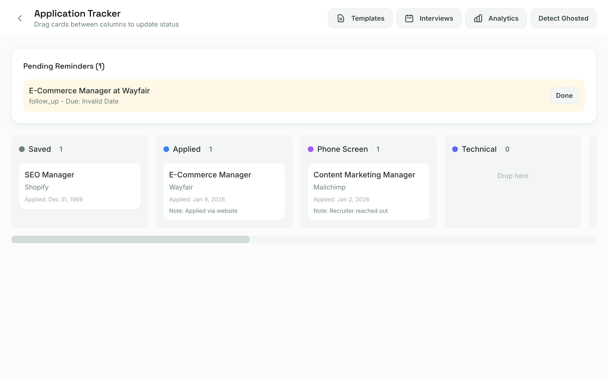

# JobSentinel Documentation

Welcome to JobSentinel documentation.

## For AI Assistants (IMPORTANT)

**If you're an AI assistant working on this codebase:**

1. **USE SUB-AGENTS** - Parallelize work with Task tool. Don't read files sequentially.
2. **UPDATE DOCS** - After ANY change, update relevant docs (see table in CLAUDE.md)
3. **CHECK FILE SIZES** - Keep files <500 lines. See [ROADMAP.md](ROADMAP.md) for refactoring plan.
4. **READ CLAUDE.md FIRST** - Contains project context and critical requirements.

### Current Work in Progress

**Plan documents:**
- **Detailed:** `.claude/plans/virtual-puzzling-pretzel.md` (full specs for E1-E4, P0-P7)
- **Public:** [ROADMAP.md](ROADMAP.md) (high-level + technical debt)

| Version | Status | Focus |
|---------|--------|-------|
| v1.4 | Complete | Ghost detection, data insights, backend persistence |
| v1.5 | Complete | File modularization (see Technical Debt) |
| v2.0 | **Complete** | **OS-Native Keyring Integration** |
| v2.1+ | Planned | CI/CD, Resume Builder, One-Click Apply |

---

## Current Status (January 2026)

**Version: 2.0.0** | 1963+ tests passing | Security-Hardened Release

### What's New in v2.0 🔐
- **OS-Native Keyring Integration** - All credentials securely stored in OS credential managers
  - macOS: Keychain | Windows: Credential Manager | Linux: Secret Service
- **6 credentials secured**: SMTP password, Telegram token, Slack/Discord/Teams webhooks, LinkedIn cookie
- **Automatic migration** - Existing plaintext credentials migrated on first launch
- See [Keyring Documentation](security/KEYRING.md) for full details

### Working Features
- **13 Job scrapers**: Greenhouse, Lever, LinkedIn, Indeed, RemoteOK, Wellfound, WeWorkRemotely, BuiltIn, HN Who's Hiring, JobsWithGPT, Dice, YC Startup Jobs, ZipRecruiter
- **Ghost Job Detection** - Identifies fake/stale job postings
- Application Tracking System (ATS) with Kanban board + interview scheduler
- AI Resume-Job Matcher with PDF parsing
- Salary AI with negotiation insights
- Market Intelligence with trend analysis
- Multi-factor scoring algorithm
- Notifications: Slack, Discord, Teams, Desktop, Email (SMTP)
- Advanced notification filtering - keyword filters, salary threshold, company lists
- Keyboard shortcuts - power user navigation (`b`, `n`, `c`, `/`, `?`, etc.)
- Advanced search - Boolean AND/OR/NOT operators, search history
- Interview prep - iCal export, prep checklists, follow-up reminders
- Enhanced analytics - Response rates, weekly goals, company response times
- Company research - 40+ companies with tech stacks
- SQLite database with full-text search
- React 19 frontend with virtual lists and error boundaries

### Screenshots

| Dashboard | Application Tracker |
|-----------|---------------------|
|  |  |

### Backend Modules (70 Tauri Commands)
- **Core**: config, db, scoring, scheduler, scrapers (13 with parallel scraping), notify, ghost
- **ATS**: 10 commands (Kanban, reminders, ghosting detection, interviews)
- **Resume Matcher**: 6 commands (upload, match, skills)
- **Salary AI**: 4 commands (predict, benchmark, negotiate, compare)
- **Market Intelligence**: 5 commands (trends, companies, locations, alerts)
- **Ghost Detection**: 3 commands (ghost jobs, statistics, filtered search)
- **User Data**: 20 commands (templates, prep checklists, saved searches, notifications, history)

### Deferred Features (v2.0+)
- One-Click Apply Automation (legal review required)

---

## Documentation Index

### For Users
- **[Quick Start Guide](user/QUICK_START.md)** - Installation and setup

### For Developers
- **[Getting Started](developer/GETTING_STARTED.md)** - Development setup
- **[Contributing](developer/CONTRIBUTING.md)** - How to contribute
- **[Architecture](developer/ARCHITECTURE.md)** - System design
- **[Why Tauri?](developer/WHY_TAURI.md)** - Why we chose Tauri over Electron/Chrome
- **[Testing](developer/TESTING.md)** - Test suite guide
- **[macOS Development](developer/MACOS_DEVELOPMENT.md)** - macOS-specific
- **[SQLite Configuration](developer/sqlite-configuration.md)** - Database setup
- **[Error Handling](developer/ERROR_HANDLING.md)** - Error patterns
- **[Mutation Testing](developer/MUTATION_TESTING.md)** - Test quality

### Security
| Topic | Documentation |
|-------|---------------|
| **Keyring Integration** | [Secure Credential Storage](security/KEYRING.md) |

### Features
| Feature | Status | Documentation |
|---------|--------|---------------|
| Ghost Detection | **v1.4** | [Ghost Detection](features/ghost-detection.md) |
| Application Tracking | Working | [ATS](features/application-tracking.md) |
| Notifications | Working | [Notifications](features/notifications.md) |
| Resume Matcher | Working | [Resume](features/resume-matcher.md) |
| Salary AI | Working | [Salary](features/salary-ai.md) |
| Market Intelligence | Working | [Market](features/market-intelligence.md) |
| Job Scrapers | Working | [Scrapers](features/scrapers.md) |

### Release Notes
- **[v2.0 - Security Hardening](releases/v2.0.md)** - OS-native keyring integration
- **[v1.6 - Additional Refactoring](releases/v1.6.md)** - Commands, scrapers, salary, resume modularization
- **[v1.5 - Modularization](releases/v1.5.md)** - File refactoring and code organization
- **[v1.4 - Ghost Hunter](releases/v1.4.md)** - Ghost job detection
- **[v1.3 - Power User](releases/v1.3.md)** - Keyboard shortcuts, advanced search
- **[v1.2 - Notifications](releases/v1.2.md)** - Multi-channel notifications

### Reports
- **[Security Audit (2026-01-16)](reports/SECURITY_AUDIT_2026-01-16.md)** - Comprehensive security analysis
- **[Deep Analysis](reports/DEEP_ANALYSIS_COMPLETE_REPORT.md)** - Security and code analysis
- **[v1.0 Status](reports/V1_COMPLETION_STATUS.md)** - Implementation tracking

### Planning
- **[Roadmap](ROADMAP.md)** - Feature roadmap and priorities

### Archive
- [One-Click Apply](archive/ONE_CLICK_APPLY_AUTOMATION.md) - Deferred to v2.0

---

## Quick Links

| I want to... | Go to... |
|--------------|----------|
| Install JobSentinel | [Quick Start](user/QUICK_START.md) |
| Set up development | [Getting Started](developer/GETTING_STARTED.md) |
| Understand ghost detection | [Ghost Detection](features/ghost-detection.md) |
| Contribute code | [Contributing](developer/CONTRIBUTING.md) |
| Understand architecture | [Architecture](developer/ARCHITECTURE.md) |
| See the roadmap | [Roadmap](ROADMAP.md) |

---

## File Structure

```
docs/
├── README.md              # This file
├── ROADMAP.md             # Feature roadmap
├── security/              # Security documentation (v2.0+)
│   └── KEYRING.md             # OS-native credential storage
├── features/              # Feature documentation
│   ├── ghost-detection.md     # Ghost job detection (v1.4)
│   ├── application-tracking.md
│   ├── notifications.md
│   ├── resume-matcher.md
│   ├── salary-ai.md
│   ├── market-intelligence.md
│   └── scrapers.md
├── releases/              # Version release notes
│   ├── v2.0.md                # Security hardening
│   ├── v1.6.md
│   ├── v1.5.md
│   ├── v1.4.md
│   ├── v1.3.md
│   └── v1.2.md
├── user/
│   └── QUICK_START.md
├── developer/
│   ├── GETTING_STARTED.md
│   ├── CONTRIBUTING.md
│   ├── ARCHITECTURE.md
│   ├── TESTING.md
│   ├── MACOS_DEVELOPMENT.md
│   ├── ERROR_HANDLING.md
│   ├── MUTATION_TESTING.md
│   └── sqlite-configuration.md
├── reports/
│   ├── SECURITY_AUDIT_2026-01-16.md
│   ├── DEEP_ANALYSIS_COMPLETE_REPORT.md
│   └── V1_COMPLETION_STATUS.md
├── archive/               # Deferred/deprecated docs
│   └── ONE_CLICK_APPLY_AUTOMATION.md
└── images/
    ├── dashboard.png
    └── kanban-board.png
```

---

**Last Updated:** January 17, 2026
