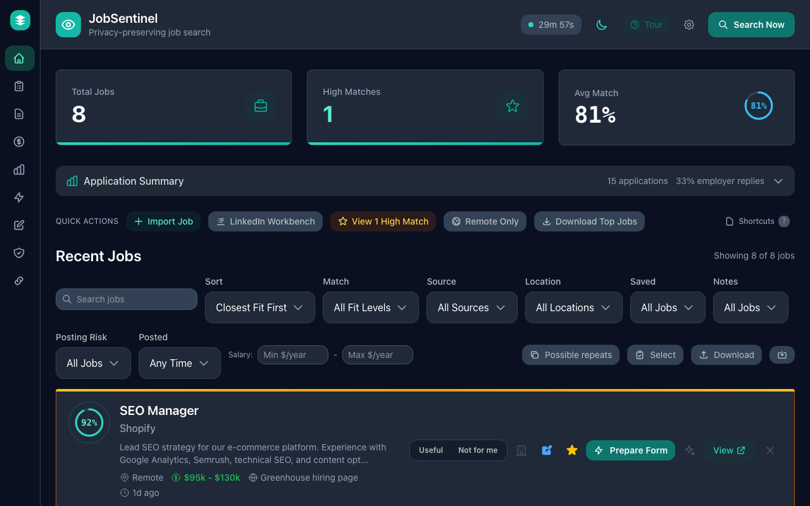
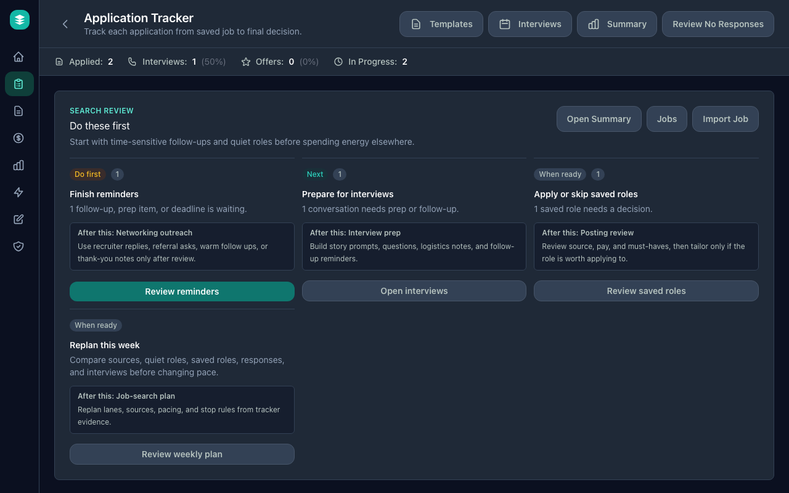
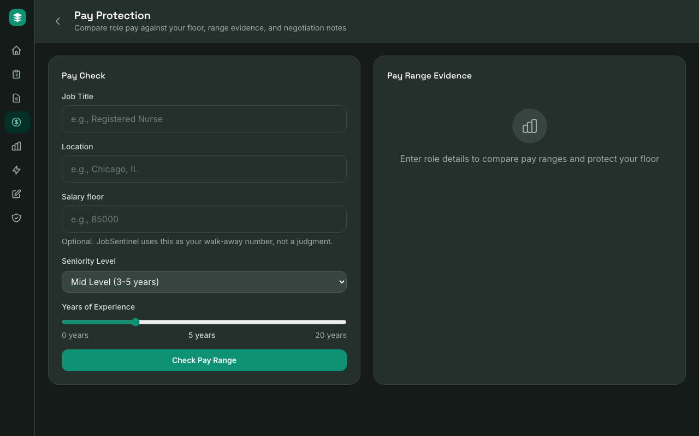
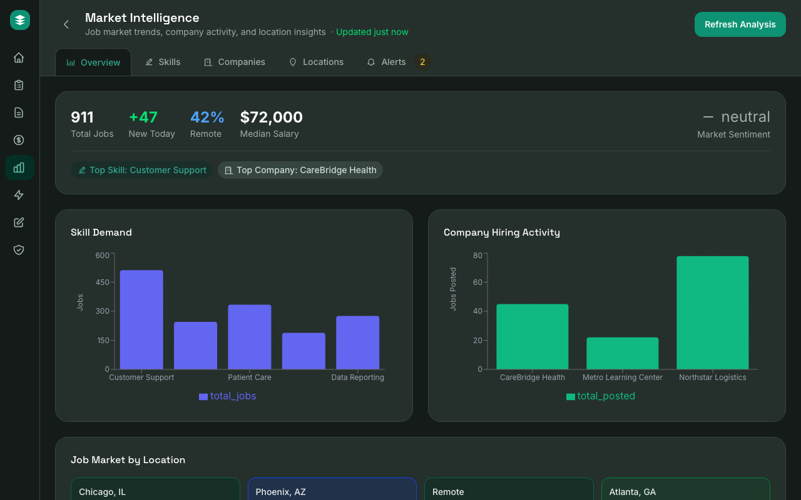
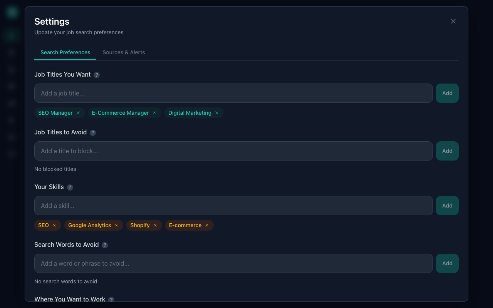
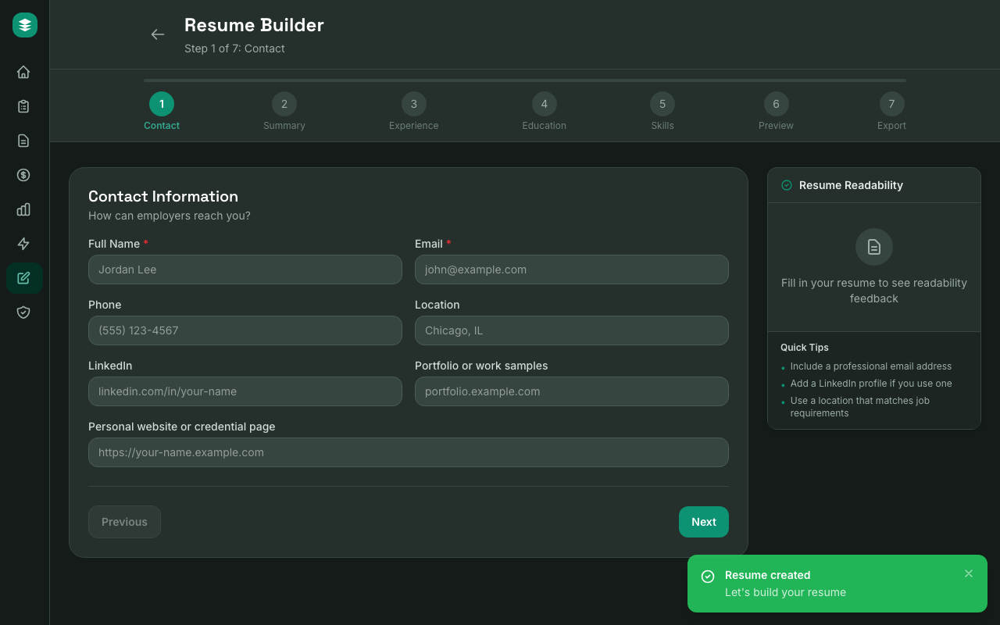
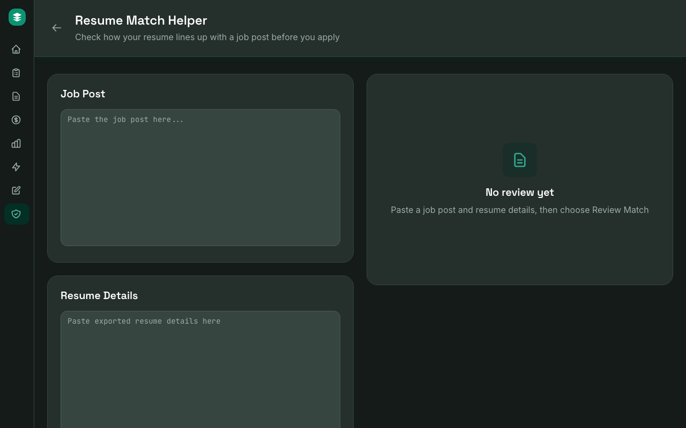
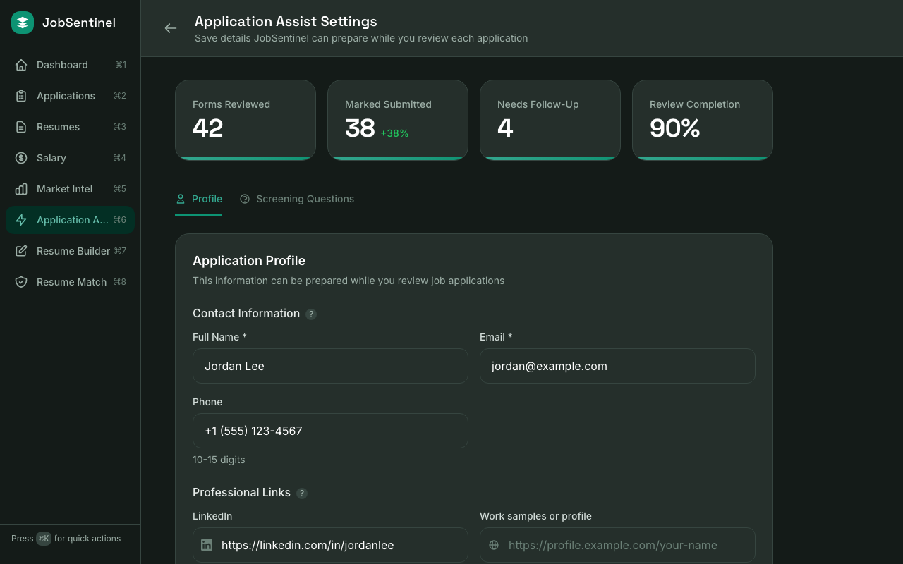

# JobSentinel Documentation

Welcome to JobSentinel documentation.

## For AI Assistants (IMPORTANT)

**If you're an AI assistant working on this codebase:**

1. **READ `AGENTS.md` FIRST** - It is the short repo entrypoint for agents.
2. **USE THE HARNESS DOCS** - Start with [Harness Engineering](harness/README.md).
3. **WRITE A CHANGE CONTRACT** - Use [Change Contract](harness/change-contract.md) for non-trivial work.
4. **RUN SENSORS** - Use [Verification Matrix](harness/verification-matrix.md).
5. **UPDATE DOCS** - Keep relevant docs current when behavior, setup, architecture, commands, or security changes.

### Current Version: 2.6.4

Current release package version is `2.6.4`. Unreleased `2.7.x` work is tracked in
[CHANGELOG.md](../CHANGELOG.md) and [ROADMAP.md](ROADMAP.md).

---

## Current Status

**Release version:** 2.6.4
**Unreleased `2.7.x` work implemented on main:** Beta feedback, one-click
sanitized debug reports, zero-technical-knowledge UX requirements,
broad-audience design guidance, docs harness alignment
**Verification:** Use `npm run harness:check`, `npm run lint`, `npm run test:run`, and Rust checks from
[Verification Matrix](harness/verification-matrix.md).

### What's New in v2.6.4

- **Settings infinite loading fixed** - Settings page no longer spins forever on first load
- **NaN score handling** - Jobs with missing salary or scoring data now display correctly instead of showing NaN
- **Bulk operation resilience** - Bulk bookmark/hide operations no longer fail silently when one job errors
- **45 new tests** - Expanded coverage for Settings, scoring edge cases, and bulk operations
- **Security updates** - Dependabot patches for transitive dependencies

### What's New in v2.6.1

- **React Performance** - 60+ useCallback hooks, 8 React.memo components, 5 useMemo optimizations
- **Reusable Hook Patterns** - Added hook patterns in v2.6.1; unreferenced generic hooks were later retired from main
- **Component Deduplication** - Icons.tsx (22 icons), AsyncButton, FilterListInput
- **Rust Optimizations** - 25+ structs with derives, 20 #[inline] hints, 4 Cow zero-copy functions
- **Database Performance** - 10 query optimizations, 8 new indexes
- **Accessibility** - 11 fixes, 13 new keyboard shortcuts
- **Error Messages** - 23 user-friendly messages with recovery suggestions
- **Memory Leaks** - 2 critical fixes (AbortController cleanup)
- **Form Validation** - 10 improvements with real-time feedback

### What's New in v2.6.0

- **Comprehensive UX Improvements** - Error recovery, loading states, accessibility
  - Retry buttons across multiple components (Market, AtsLiveScorePanel, ApplyButton, DashboardWidgets, NotificationPreferences)
  - Stale data indicators with color-coded timestamps
  - Skeleton loaders for better perceived performance
  - Inline validation with real-time feedback
  - Unsaved changes warnings
  - Actionable empty states with guidance

- **Performance Optimizations** - React.memo and context optimization
  - 50+ components memoized to prevent unnecessary re-renders
  - All context providers optimized with useCallback/useMemo
  - Lookup objects replace switch statements
  - Fixed memory leak in ToastContext (timer cleanup)

- **Accessibility Enhancements**
  - Navigation: Added aria-label for main navigation
  - Dropdown: Added aria-activedescendant for keyboard navigation
  - Tooltip: Escape key dismisses tooltips
  - Badge: Contextual remove button labels

- **Test Coverage** - Vitest, Playwright, Rust unit/integration tests, and docs harness checks

- See [v2.6.0 Release Notes](releases/v2.6.0.md) for full details

### What's New in v2.5.3

- **LinkedIn Auto-Connect** - Zero-copy authentication, no technical knowledge required
  - Click "Connect LinkedIn", log in normally, and finish.
  - Native macOS WebKit integration for automatic cookie extraction
  - No more DevTools, no more copy-paste
  - Cookie stored securely in OS keychain
- See [LinkedIn Setup](features/scrapers.md#-linkedin-scraper) for details

### What's New in v2.5

- **Market Intelligence UI** - Complete visualization layer with interactive charts
  - MarketSnapshotCard - Daily market summary with sentiment indicators
  - TrendChart - Recharts-powered line/bar charts for trends
  - LocationHeatmap - Interactive job density grid
  - MarketAlertCard - Alert display with mark-as-read
- **Tabbed Market Page** - Overview, Skills, Companies, Locations, Alerts tabs
- **Enhanced Backend Types** - Week-over-week change calculations
- **4 new Tauri commands** for market operations
- See [Market Intelligence Documentation](features/market-intelligence.md) for full details

### What's New in v2.0 Security Hardening

- **OS-Native Keyring Integration** - All credentials securely stored in OS credential managers
  - macOS: Keychain | Windows: Credential Manager | Linux: Secret Service
- **6 credentials secured**: SMTP password, Telegram token, Slack/Discord/Teams webhooks, LinkedIn cookie
- **Automatic migration** - Existing plaintext credentials migrated on first launch
- See [Keyring Documentation](security/KEYRING.md) for full details

### What's New in v2.0 Resume Tools

- **Resume Builder** - 7-step wizard for creating professional resumes
  - 5 ATS-optimized templates (Classic, Modern, Skills-First, Executive, Military)
  - DOCX export with professional formatting
- **ATS Optimizer** - Analyze resumes against job descriptions
  - Keyword extraction and scoring
  - Bullet point improver with 45+ power words
- **22 new Tauri commands** for resume operations
- See [Resume Builder Documentation](features/resume-builder.md) for full details

### What's New in v2.0 One-Click Apply

- **One-Click Apply Automation** - Human-in-the-loop form filling
  - 7 ATS platforms: Greenhouse, Lever, Workday, Taleo, iCIMS, BambooHR, Ashby
  - Application profile for contact info and URLs
  - Screening question auto-answers with regex patterns
  - Visible browser automation (user always clicks Submit)
  - CAPTCHA detection with user prompts
- **18 new Tauri commands** for automation
- See [One-Click Apply Documentation](features/one-click-apply.md) for full details

### Working Features

- **13 Job scrapers**: Greenhouse, Lever, LinkedIn, RemoteOK, WeWorkRemotely, BuiltIn,
  HN Who's Hiring, JobsWithGPT, Dice, YC Startup Jobs, USAJobs, SimplyHired, Glassdoor
- **Ghost Job Detection** - Flags stale, reposted, and low-trust postings
- Application Tracking System (ATS) with Kanban board + interview scheduler
- AI Resume-Job Matcher with PDF parsing
- Salary AI with negotiation insights
- Market Intelligence with trend analysis
- Multi-factor scoring algorithm
- Notifications: Slack, Discord, Teams, Desktop, Email (SMTP)
- Advanced notification filtering - keyword filters, salary threshold, company lists
- Keyboard shortcuts - power user navigation (`b`, `n`, `c`, `/`, `?`, etc.)
- Advanced search - Boolean AND/OR/NOT operators, search history
- Interview prep - iCal export, prep checklists, follow-up reminders
- Enhanced analytics - Response rates, weekly goals, company response times
- Company research - 40+ companies with tech stacks
- SQLite database with full-text search
- React 19 frontend with virtual lists and error boundaries

### Screenshots

| Dashboard                          | Application Tracker                                      |
| ---------------------------------- | -------------------------------------------------------- |
|  |  |

| Resume Matcher                               | Salary AI                          |
| -------------------------------------------- | ---------------------------------- |
|  |  |

| Market Intelligence                                    | Settings                         |
| ------------------------------------------------------ | -------------------------------- |
|  |  |

| Resume Builder                               | ATS Optimizer                              |
| -------------------------------------------- | ------------------------------------------ |
|  |  |

| One-Click Apply                                |
| ---------------------------------------------- |
|  |

### Backend Modules (190 registered Tauri commands)

- **Core**: config, db, scoring, scheduler, scrapers (13 with parallel scraping), notify, ghost
- **ATS**: Kanban, reminders, ghosting detection, interviews, and application stats
- **Resume Matcher**: JSON Resume import, uploaded resumes, matching, and skill profile management
- **Resume Builder**: drafts, sections, templates, rendering, exports, and ATS analysis
- **Salary AI**: predictions, benchmarking, negotiation scripts, and offer comparison
- **Market Intelligence**: trends, companies, locations, alerts, snapshots, and history
- **Ghost Detection**: posting-risk signals, statistics, filtered search, feedback, and configuration
- **User Data**: templates, prep checklists, saved searches, notifications, migration, and history
- **One-Click Apply**: profile, screening answers, attempts, ATS detection, and browser control
- **Health**: scraper health, smoke tests, run history, and credential expiry
- **Feedback**: GitHub, Google Drive, one-click sanitized debug reports, debug summaries, and log events

### Planned / Unreleased Features

- Beta feedback workflow (implemented on main, tracked for `2.7.0`)
- One-click sanitized debug reports in the next packaged release
- Continued zero-technical-knowledge UX review
- Continued broad-audience review for technical and non-technical roles
- Machine learning improvements

---

## Documentation Index

### For Users

- **[Quick Start Guide](user/QUICK_START.md)** - Installation and setup

### For Developers

- **[Harness Engineering](harness/README.md)** - Agent-readable repo operating model
- **[Exec Plans](exec-plans.md)** - Durable planning format for multi-step work
- **[Getting Started](developer/GETTING_STARTED.md)** - Development setup
- **[Contributing](developer/CONTRIBUTING.md)** - How to contribute
- **[Architecture](developer/ARCHITECTURE.md)** - System design
- **[Why Tauri?](developer/WHY_TAURI.md)** - Why we chose Tauri over Electron/Chrome
- **[Testing](developer/TESTING.md)** - Test suite guide
- **[E2E Testing](../tests/README.md)** - Playwright browser E2E tests
- **[macOS Development](developer/MACOS_DEVELOPMENT.md)** - macOS-specific
- **[SQLite Configuration](developer/sqlite-configuration.md)** - Database setup
- **[Error Handling](developer/ERROR_HANDLING.md)** - Error patterns
- **[Mutation Testing](developer/MUTATION_TESTING.md)** - Test quality

### Security

| Topic                   | Documentation                                    |
| ----------------------- | ------------------------------------------------ |
| **Keyring Integration** | [Secure Credential Storage](security/KEYRING.md) |

### Features

| Feature                | Status   | Documentation                                  |
| ---------------------- | -------- | ---------------------------------------------- |
| Market Intelligence UI | **v2.5** | [Market](features/market-intelligence.md)      |
| One-Click Apply        | **v2.0** | [One-Click Apply](features/one-click-apply.md) |
| Resume Builder         | **v2.0** | [Resume Builder](features/resume-builder.md)   |
| Ghost Detection        | **v1.4** | [Ghost Detection](features/ghost-detection.md) |
| Application Tracking   | Working  | [ATS](features/application-tracking.md)        |
| Notifications          | Working  | [Notifications](features/notifications.md)     |
| Resume Matcher         | Working  | [Resume Matcher](features/resume-matcher.md)   |
| Salary AI              | Working  | [Salary](features/salary-ai.md)                |
| Job Scrapers           | Working  | [Scrapers](features/scrapers.md)               |

### Release Notes

- **[v2.6.3 - Security & Stability](releases/v2.6.3.md)** - Security fixes, memory leaks, standardized errors
- **[v2.6.0 - UX Improvements](releases/v2.6.0.md)** - Error recovery, loading states, accessibility, performance
- **[v2.5.3 - LinkedIn Auto-Connect](releases/v2.5.3.md)** - Zero-copy LinkedIn authentication
- **[v2.5.2 - Bug Fixes](releases/v2.5.2.md)** - Onboarding and settings fixes
- **[v2.5.1 - Production Release](releases/v2.5.1.md)** - Official installers for Windows and macOS
- **[v2.5 - Market Intelligence UI](releases/v2.5.md)** - Interactive charts, tabbed layout, heatmaps
- **[v2.4 - Resume UI Enhancements](releases/v2.4.md)** - Skill visualization, comparison views
- **[v2.3 - Health Monitoring](releases/v2.3.md)** - Scraper health, smoke tests
- **[v2.2 - Additional Features](releases/v2.2.md)** - Bug fixes and improvements
- **[v2.1 - CI/CD](releases/v2.1.md)** - Build pipeline, testing improvements
- **[v2.0 - Security Hardening](releases/v2.0.md)** - OS-native keyring integration
- **[v1.6 - Additional Refactoring](releases/v1.6.md)** - Commands, scrapers, salary, resume modularization
- **[v1.5 - Modularization](releases/v1.5.md)** - File refactoring and code organization
- **[v1.4 - Ghost Hunter](releases/v1.4.md)** - Ghost job detection
- **[v1.3 - Power User](releases/v1.3.md)** - Keyboard shortcuts, advanced search
- **[v1.2 - Notifications](releases/v1.2.md)** - Multi-channel notifications

### Planning

- **[Roadmap](ROADMAP.md)** - Feature roadmap and priorities
- **[Plans](plans/README.md)** - Active, completed, and template plans
  - [v2.6.0 UX Improvements](plans/completed/v2.6.0-ux-improvements.md) - Completed sprint

---

## Quick Links

| I want to...               | Go to...                                        |
| -------------------------- | ----------------------------------------------- |
| Install JobSentinel        | [Quick Start](user/QUICK_START.md)              |
| Set up development         | [Getting Started](developer/GETTING_STARTED.md) |
| Understand ghost detection | [Ghost Detection](features/ghost-detection.md)  |
| Contribute code            | [Contributing](developer/CONTRIBUTING.md)       |
| Understand architecture    | [Architecture](developer/ARCHITECTURE.md)       |
| See the roadmap            | [Roadmap](ROADMAP.md)                           |

---

## File Structure

Docs layout:

- `docs/README.md`: this file
- `docs/ROADMAP.md`: feature roadmap
- `docs/CLAUDE.md`: compatibility pointer; `AGENTS.md` is authoritative
- `docs/exec-plans.md`: exec plan format
- `docs/harness/`: harness engineering guides and sensors
- `docs/developer/`: developer documentation
- `docs/developer/GETTING_STARTED.md`: setup guide
- `docs/developer/CONTRIBUTING.md`: contribution guide
- `docs/developer/ARCHITECTURE.md`: architecture guide
- `docs/developer/TESTING.md`: testing guide
- `docs/developer/RELEASING.md`: release process
- `docs/features/`: feature documentation
- `docs/features/one-click-apply.md`: One-Click Apply feature guide
- `docs/features/resume-builder.md`: Resume Builder feature guide
- `docs/features/ghost-detection.md`: ghost detection feature guide
- `docs/releases/`: version release notes
- `docs/plans/`: active, completed, and template plans
- `docs/security/`: security documentation
- `docs/user/`: user documentation
- `docs/images/`: screenshots

Test docs layout:

- `tests/README.md`: testing overview
- `tests/e2e/playwright/`: Playwright E2E tests
