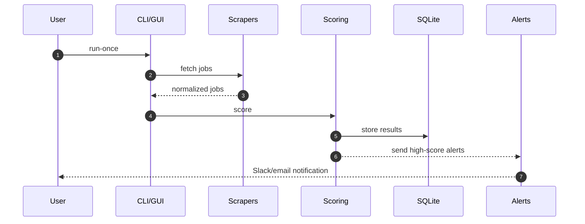

# Threat Model

This document outlines the data flows, trust boundaries, assets, and key threats for JobSentinel.
It aligns with OWASP ASVS controls and focuses on a local‑first architecture.

## Data Flow (Mermaid)

```mermaid
flowchart TD
  U[User] -->|Configures| CFG[Local Config (.env, user_prefs.json)]
  U -->|Runs| CLI[CLI / GUI]
  CLI --> SCR[Scrapers]
  SCR -->|Public HTTP(S)| JOBS[(Job Sites)]
  SCR -->|Normalize| CORE[Scoring Engine]
  CORE --> DB[(SQLite)]
  CORE -->|High score| ALERT[Alerts]
  ALERT --> SLACK[(Slack Webhook)]
  U -->|Reviews| WEB[Web UI]
  WEB --> DB

  classDef boundary fill:#fff,stroke:#333,stroke-width:2px,stroke-dasharray: 5 5
  class CFG,CLI,SCR,CORE,DB,WEB boundary
```

## Trust Boundaries

- Local System (trusted): CLI/GUI, Scrapers, Scoring Engine, SQLite DB, Web UI.
- External (untrusted): Public job sites (HTTP/S), Slack Incoming Webhook.

## Assets

- Local config (API keys, preferences)
- Job data (titles, descriptions, companies, salaries)
- Logs and telemetry (local only)
- Alerts (messages sent to Slack/email if configured)

## Threats and Controls (OWASP ASVS aligned)

- Input validation (ASVS 5.1): Validate and sanitize all inputs from external sites.
- SSRF/URL validation (ASVS 5.3): Allow list and strict URL parsing for outbound requests.
- Rate limiting (ASVS 4.3): Per‑source backoff/jitter to avoid abuse and throttling.
- Secrets handling (ASVS 2.2): Store secrets in environment variables (`.env`), never commit.
- Storage security (ASVS 9.x): SQLite local storage; optional at‑rest encryption planned.
- Logging (ASVS 7.x): Structured logs, avoid PII; redact secrets.
- Dependency security (ASVS 14.x): Pinned versions; Dependabot; CI security scans.
- Least privilege (ASVS 1.1): Scrapers are read‑only; no writes to job boards.

## Sequence: Run Once (Mermaid)



## Assumptions

- Jobs are fetched from public endpoints only; no credentialed scraping.
- All processing runs locally unless the user deploys to cloud intentionally.
- Users manage and protect their own local environment.

## Open Questions

- Optional at‑rest encryption for SQLite (SQLCipher) rollout plan.
- Pluggable secrets providers (1Password, Keychain) for desktop setups.

Last reviewed: October 2025
