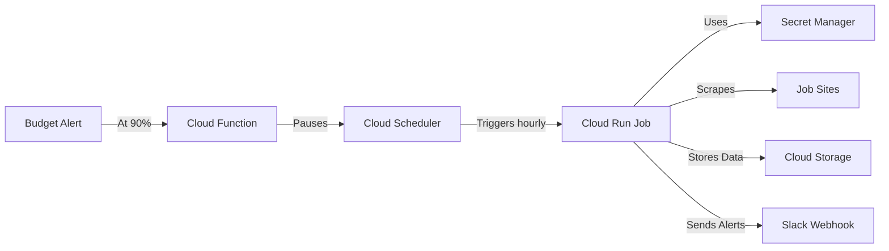

# Windows Quick Start

## What you get

Job scraper that pings you on Slack when matching jobs appear. Runs on Google Cloud for $0-5/month. No code required.

## Install (one command)

Open PowerShell as Administrator:

```powershell
Set-ExecutionPolicy Bypass -Scope Process -Force; `
[System.Net.ServicePointManager]::SecurityProtocol = [System.Net.ServicePointManager]::SecurityProtocol -bor 3072; `
iex ((New-Object System.Net.WebClient).DownloadString('https://raw.githubusercontent.com/cboyd0319/job-private-scraper-filter/main/setup_windows.ps1'))
```

Installer checks system requirements, installs dependencies (Python 3.12, gcloud SDK), clones repo to `%USERPROFILE%\job-scraper`, and walks you through GCP setup.

## Setup flow

**Google Cloud (5 min)**
1. Create account at https://cloud.google.com (Gmail works)
2. Enable billing (free tier = $300 credit for 90 days)
3. Authenticate when browser opens
4. Pick region (default: `us-central1`, cheapest)

**Slack webhook (2 min)**
1. Create free workspace: https://slack.com/create
2. Create incoming webhook: https://api.slack.com/apps
3. Copy URL (format: `https://hooks.slack.com/services/...`)
4. Paste when prompted

**Deploy (10 min)**
- Creates GCP project `job-scraper-YYYYMMDD-HHMMSS`
- Sets up Cloud Run Job (serverless)
- Configures scheduler (hourly, business hours Mon-Fri)
- Creates budget alerts at $5 with auto-shutdown at 90%

## Common commands

**Manual run**
```powershell
cd %USERPROFILE%\job-scraper
.\.venv\Scripts\Activate.ps1
python src/agent.py --mode poll
```

**Update code**
```powershell
cd %USERPROFILE%\job-scraper
.\secure-update.ps1
```

**Teardown (delete all GCP resources)**
```powershell
cd %USERPROFILE%\job-scraper
.\scripts\teardown-cloud.ps1 gcp
```

**Check status**
```powershell
gcloud run jobs describe job-scraper --region us-central1 --project YOUR_PROJECT_ID
```

**View logs**
```powershell
gcloud logging read "resource.type=cloud_run_job" --limit 50 --project YOUR_PROJECT_ID
```

## Costs

**Expected**: $0-2/month (free tier covers most)
**Max**: $5/month (auto-shutdown at $4.50)

**What runs:**
- Cloud Run Job: Scheduled only (13 hrs/week)
- Cloud Storage: ~10MB data
- Artifact Registry: 1 container image (~500MB)
- Secret Manager: 2 secrets

**Budget alerts:** Email at 50% ($2.50), 80% ($4.00), 90% ($4.50 → auto-pause)

## Troubleshooting

**Execution policy error**
```powershell
Set-ExecutionPolicy RemoteSigned -Scope CurrentUser -Force
```

**Python not found**
Installer auto-installs. If it fails, download from https://www.python.org/downloads/windows/ and check "Add Python to PATH".

**gcloud not found**
Installer auto-installs. If it fails, download from https://cloud.google.com/sdk/docs/install.

**Project quota exceeded**
You hit the 12-project limit. Delete old ones:
```powershell
gcloud projects list --filter="lifecycleState:ACTIVE"
gcloud projects delete PROJECT_ID
```

**Terraform init fails**
```powershell
cd %USERPROFILE%\job-scraper\terraform\gcp
terraform init -upgrade
terraform plan
```

**No jobs in Slack**
1. Check last run: `gcloud run jobs executions list --job job-scraper --region us-central1`
2. View logs: `gcloud logging read "resource.type=cloud_run_job" --limit 20`
3. Test webhook: `curl -X POST YOUR_WEBHOOK_URL -d '{"text":"Test"}'`

## Security

**Local installs:**
- Python 3.12 → `C:\Python312\`
- gcloud SDK → `%LOCALAPPDATA%\Google\Cloud SDK\`
- Repository → `%USERPROFILE%\job-scraper`
- Credentials → `%APPDATA%\gcloud\`

**Secrets storage:**
- Never commit `.env` or `user_prefs.json`
- Secrets live in GCP Secret Manager (encrypted at rest)
- Cloud Run uses Workload Identity (no API keys in containers)

**Network:**
- Cloud Run job runs in private VPC
- No public ingress
- Egress via Cloud NAT

⚠️ Teardown requires explicit confirmation. Type 'yes delete everything' or script cancels safely.

## Architecture



## Manual deployment (if installer fails)

```powershell
git clone https://github.com/cboyd0319/job-private-scraper-filter.git
cd job-private-scraper-filter
python -m venv .venv
.\.venv\Scripts\Activate.ps1
pip install -r requirements.txt
python -m cloud.bootstrap --provider gcp --log-level info
```

## Quick reference

| Action | Command |
|--------|---------|
| Deploy | `python -m cloud.bootstrap --yes` |
| Update | `.\secure-update.ps1` |
| Test local | `python src/agent.py --mode test` |
| View logs | `gcloud logging read --limit 20` |
| Teardown | `.\scripts\teardown-cloud.ps1 gcp` |
| Check budget | `gcloud billing budgets list` |
| Pause scheduler | `gcloud scheduler jobs pause job-scraper-schedule` |
| Resume scheduler | `gcloud scheduler jobs resume job-scraper-schedule` |

## Notes

- First run takes ~15 min for Cloud Run to warm up
- Edit `config/user_prefs.json` after deployment to customize job filters
- Test webhook before deploying: `curl -X POST YOUR_URL -d '{"text":"Test"}'`
- Set additional budget alerts in GCP Console if desired
- Export data weekly: `gsutil cp gs://YOUR_BUCKET/* ./backups/`
