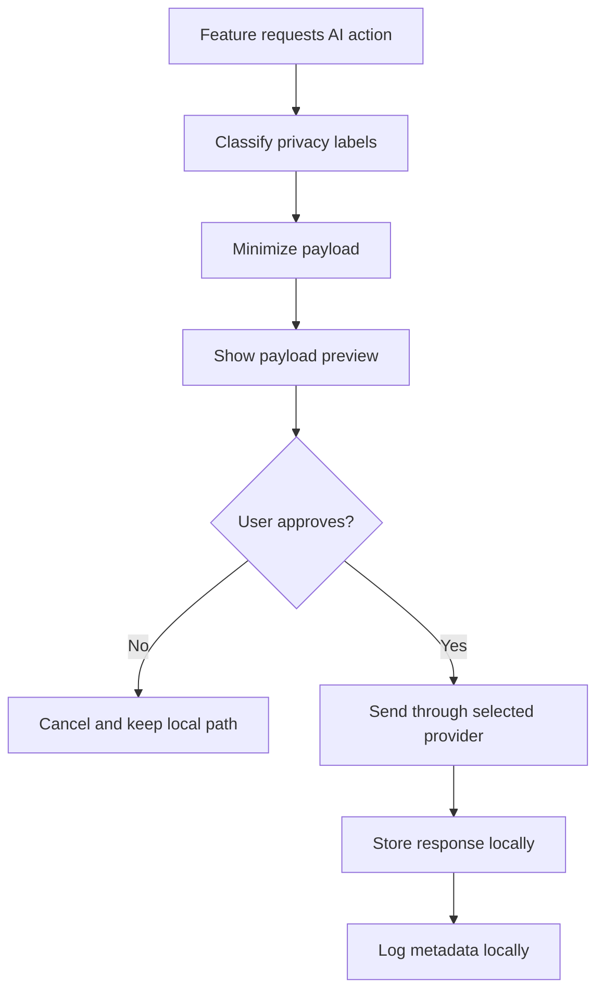

# Privacy-First AI Gateway

JobSentinel is local-first. External AI is optional, disabled by default, and
must be routed through one gateway. Core workflows must work locally without
OpenAI or any other external provider.

Rule 0: user privacy and security are non-negotiable. The AI gateway is a
guardrail, not a convenience wrapper. No AI provider, prompt path, local
fallback, fixture, or developer shortcut may skip opt-in, payload preview,
redaction, approval, sensitive-data minimization, credential safety, or local
metadata logging.

## Boundary

Sensitive job-search data includes employment status, resumes, salary floors,
application activity, private notes, location preferences, career goals,
personal circumstances, urgency, and identity/contextual information.

External AI is allowed only as an explicit, inspectable assistive layer. It must
not become the foundation for job tracking, saved searches, application Kanban,
first-seen or last-seen tracking, ghost-job heuristics, salary floors, or local
debug reports.

## Request Lifecycle



Required lifecycle:

1. Feature requests AI action.
2. Classify data sensitivity and feature privacy labels.
3. Minimize payload to the smallest useful set of fields.
4. Preview exact payload.
5. User approves or cancels.
6. Send to selected provider only after approval.
7. Store response locally.
8. Log metadata locally: feature, provider, timestamp, and high-level data
   categories sent.

## Gateway Rules

- External AI disabled by default.
- Provider set to `none` by default.
- No silent external AI calls.
- No raw full database dumps.
- No private notes or unrelated application history by default.
- No resume text or salary floor by default.
- Sensitive fields require explicit user selection and sensitive-payload opt-in.
- Payload preview is required before external calls where UI workflow exists.
- Redaction, edit, and cancel paths are required where UI exists.
- Public-data-only prompts must include only job posting content or public
  metadata.
- Reviewed outgoing text with obvious prompt-like instructions, hidden
  instructions, or invisible instruction markers must stay local until the user
  removes that text from the reviewed outgoing payload.
- Local-only fallback is preferred. If a feature cannot run locally, label it
  `External AI required` before any provider is enabled.

## Feature Privacy Labels

The machine-readable repo index lives at
[`docs/harness/feature-privacy-labels.json`](../harness/feature-privacy-labels.json)
and is validated by `npm run harness:check`.

| Label | Meaning |
| ----- | ------- |
| Local only | No data leaves the device. |
| External AI optional | User can choose local or external AI behavior. |
| External AI required | Feature needs a provider call and must require explicit opt-in. |
| Sensitive | May involve resume, salary, private notes, or application history. |
| Public-data only | Uses job posting content or public metadata only. |

Examples:

| Feature | Labels |
| ------- | ------ |
| Job tracking | Local only |
| Saved searches | Local only |
| Application Kanban | Local only |
| First-seen and last-seen job tracking | Local only |
| Ghost-job heuristic scoring | Local only |
| Ghost-job explanation with external AI | External AI optional, Public-data only |
| Job description summary | External AI optional, Public-data only |
| Resume/job fit explanation | External AI optional, Sensitive |
| Negotiation prep | External AI optional, Sensitive |
| Salary transparency check | Local only or External AI optional |

## Settings Contract

Persisted settings should use this shape when external AI settings are wired
into app configuration:

```text
external_ai.enabled = false
external_ai.provider = none
external_ai.require_payload_preview = true
external_ai.allow_sensitive_payloads = false
external_ai.redaction.enabled = true
external_ai.log_requests_locally = true
```

Provider credentials must not be hardcoded. User-provided API keys should be
stored in the operating system credential store where supported.

## Code Contract

The frontend gateway boundary lives in `src/shared/externalAi/`. It defines:

- `FeaturePrivacyLabel`
- `ExternalAiSettings`
- `ExternalAiRequest`
- `ExternalAiDataCategory`
- `ExternalAiGateway`

`ExternalAiRequest.payload` is the candidate payload prepared by a feature.
When `external_ai.redaction.enabled = true`, callers must also provide
`ExternalAiRequest.redactedPayload`, which is the reviewed payload that may be
sent. The gateway sends only that reviewed payload to provider transports.

External provider transports should plug into that gateway instead of creating
provider-specific calls throughout the codebase. Production code should not call
external AI provider APIs outside this gateway.

## Current Status And Release Contract

Release status for the current maintenance line: Settings can configure
optional outside-AI providers, provider preference order, per-provider model
names, and provider keys through `CredentialService`. Provider keys stay in the
local secure vault, not in settings backups. The first user-facing provider
path is public job posting summary from a job card. It is optional,
public-data-only, previewed, editable, cancellable, and backend-validated
before provider transport. Metadata-only request history is viewable in
Settings and does not store the reviewed payload.

Implemented now:

- Gateway types and default settings.
- Disabled-by-default guard.
- Provider-required guard.
- Settings provider setup for OpenAI, Anthropic, Google Gemini, GitHub Copilot,
  and custom HTTPS providers.
- Multi-provider preference order and per-provider model-name config.
- Provider key storage through the local credential vault.
- Payload preview and user-approval guards.
- Redacted payload required when redaction is enabled.
- Reviewed redacted payload sent instead of raw feature payload.
- Classified payload-key guard for unknown fields.
- Prompt-like, hidden, encoded, and typo-obfuscated reviewed outgoing text
  blocks before provider transport.
- Sensitive-payload guard.
- Full-database block.
- Public-data-only payload guard.
- Local metadata logging hook.
- Provider transports for OpenAI, Anthropic, Google Gemini, GitHub Copilot, and
  custom HTTPS endpoints.
- Public job-posting summary from a job card after review and approval.
- Settings request-history viewer with clear-history action.

Release contract for shipped external AI features:

- Every shipped production `ExternalAiRequest.feature` value must be listed in
  `docs/harness/feature-privacy-labels.json` with local fallback guidance and
  an external-AI label when it can call a provider.
- The only shipped provider-backed UI action is
  `job-description-summary`, a public-data-only job-card action that can still
  fall back to local job-card details, local fit signals, posting-risk cues, and
  extracted public fields.
- No private-data external AI feature ships in the current maintenance line. A
  future private-data feature must add feature-specific payload minimization,
  privacy labels, backend validation, preview, edit, cancel, approval,
  redaction, and metadata-only request-history coverage before it becomes
  available.
- Sensitive payload opt-in stays off unless a future feature has the same
  reviewed gateway path and focused tests.
