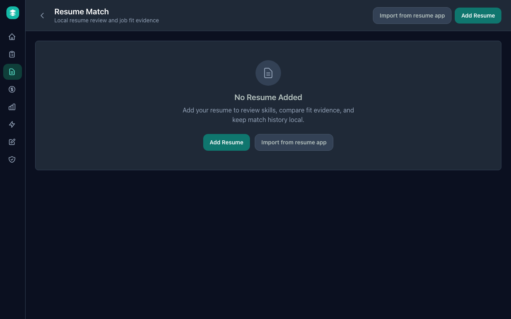

# Resume Match

**Compare a resume with a job posting locally, then decide where careful
tailoring is worth the time.**

Resume matching helps job seekers see how their resume lines up with a role
without sending the resume to a cloud service by default. It is not a promise
that an employer will respond, and it is not a tool for deceptive resume tricks.
It is a local, advisory signal for readability, fit, and preparation.

## Privacy Labels

| Workflow | Label | Default behavior |
| --- | --- | --- |
| Resume add and parsing | Local only, Sensitive | Resume text and file details stay local. |
| Readable text preview | Local only, Sensitive | The user can explicitly open and copy a bounded preview of text JobSentinel read from the selected resume. |
| Resume library | Local only, Sensitive | Resume versions stay on this device. |
| Skill review and edits | Local only, Sensitive | User edits stay local. |
| Reviewed-skill sorting preference | Local only, Sensitive | A user can explicitly use reviewed local skills as one job-sorting signal. |
| Resume/job fit review | Local only, Sensitive | Resume data is compared with saved job data locally. |
| Job posting text | Public-data only | Job descriptions are public or user-saved posting content. |
| Scanned resume PDFs | Local only, Sensitive | If enabled, JobSentinel tries to read scanned resume text on this device. |

External AI is not required for resume matching.

## What It Helps With

- **Resume readability**: Confirm and copy the text JobSentinel can read from
  the selected resume.
- **Readable structure review**: Flag missing top contact details, missing
  standard section headings, table-like extracted text, hidden instructions,
  and other practical readability risks.
- **Fit review**: Compare resume skills, experience, and education with a job
  posting.
- **Truthful tailoring**: See which real experience might be worth making more
  visible.
- **Requirement inventory**: Separate must-have requirements, high-value terms,
  supporting terms, and words that should not be forced into the resume.
- **Knockout consistency review**: Notice when required form answers should be
  supported by visible resume evidence, such as licenses, work authorization,
  location, required tools, or years of experience.
- **Gap awareness**: Notice missing or weakly represented requirements before
  spending time on a role.
- **Resume safety review**: Flag prompt-injection-like instructions, hidden
  text, and invisible characters with a plain **Safety check** label before
  the resume is used.
- **Reviewed-skill sorting**: After reviewing saved skills, choose whether
  those local skills should help sort jobs alongside titles, search words,
  salary, location, and company preferences.
- **Multiple resumes**: Keep different resume versions for different kinds of
  work.
- **Broad career coverage**: Recognize skills from technical and non-technical
  fields, including operations, healthcare, education, sales, marketing,
  customer support, finance, legal, creative, data, and security work.

## Everyday Workflow

1. Open **Resume Match**.
2. Paste the job post.
3. If you already have an active saved resume, JobSentinel selects it for the
   review automatically. Choose **Choose or Add Resume** only when you need to
   add, change, or refresh the selected resume.
4. Choose **See what JobSentinel read** if you want to inspect the readable
   resume text before using match results.
5. Use **Import from resume app** only if another resume app gave you export
   text.
6. Click **Review Match**.
7. Review suggested skills and add anything important that was missed.
8. Choose **Use these skills to sort jobs** if the reviewed local skills should
   influence job sorting.
9. Open job details from the dashboard to see recent resume fit reviews.
10. Use skills found in both places and skills to review as evidence for a
   decision:
   tailor carefully, save for later, ask a question, or skip.

JobSentinel should explain fit in plain language. A person should not need to
understand parsing, scoring, or employer screening systems to use the result.
JobSentinel should also make clear that local fit and readability results are
diagnostics, not predictions of how a specific employer will screen or respond.

## How To Read Fit Results

| Signal | Meaning | Use it for |
| --- | --- | --- |
| Overall fit | Combined fit signal from skills, experience, and education. | Decide whether the role deserves more attention. |
| Skills fit | Resume skills that appear relevant to the posting. | Find real strengths to make clearer. |
| Experience fit | Years or level signals found in the posting and resume. | Notice lower-title, lower-pay, or stretch-role risk. |
| Education fit | Degree or credential signals found in the posting and resume. | Spot requirements that may need explanation. |
| Skills to review | Posting requirements not clearly represented in the resume. | Decide whether to revise, ask, learn, or skip. |
| Required or preferred wording to review | Missing job-post language grouped by importance. | Start with required evidence before reviewing nice-to-have wording. |

Low fit does not mean "do not apply." It means "review fit before spending
extra time." Strong fit does not guarantee a response. It means the resume and
posting share stronger visible evidence.

Resume quality and role fit are separate. A clear resume can still be a poor
fit for a role, and a plausible role fit can still need format cleanup before
submission.

## Responsible Use

Resume matching must stay candidate-side and honest:

- Do not fabricate qualifications.
- Do not hide keywords.
- Do not stuff resumes with unrelated terms.
- Do not prompt-inject resumes.
- Do not present the fit estimate as an employer decision.
- Do not encourage users to apply to roles that violate their salary floor,
  location constraints, schedule needs, or other must-haves.

The right goal is application readability and truthful fit, not manipulating
employer screening systems.

## Local Matching Model

The current local matcher:

- extracts readable text from PDF, DOCX, TXT, and Markdown resumes;
- shows the resume format and whether readable text is available before review;
- provides an explicit local preview of readable resume text without returning
  the saved file path;
- tells users to follow employer file instructions first when readable text is
  missing, then suggests readable PDF, DOCX, TXT, or Markdown when no format is
  named;
- uses the same employer-instructions-first guidance inside the empty
  readable-text preview;
- checks the extracted text for common application-readability risks such as
  missing top contact details, missing standard section headings, table-like
  text, hidden instruction-like content, and work bullets that read like
  keyword lists, generic filler, or mix ownership with exposure-only wording
  instead of plain work evidence;
- treats **Career Break**, **Career Pause**, and caregiving labels as readable
  resume headings instead of structural mistakes;
- treats **Volunteer Experience**, **Community Involvement**, and **Military
  Service** as readable resume headings and experience evidence instead of
  structural mistakes;
- can review the active saved resume against a pasted job post without copying
  structured resume details into the page;
- loads the active saved resume on page open so the user can paste a job post
  and review fit without knowing any technical setup steps;
- shows the selected resume format and readable-text status before match review
  without exposing saved file paths or raw resume text;
- shows a Resume Fit evidence-status label, such as checking must-haves first,
  mixed evidence, not enough job detail, or clearer evidence, so the score is
  treated as local evidence review instead of an employer prediction;
- identifies skills and job-post terms across broad career categories,
  including healthcare, education, service, operations, trades, legal, finance,
  and government or administrative work;
- lets reviewed local skills influence job sorting only after the user turns
  that preference on;
- compares resume evidence with saved job-posting text;
- returns fit, experience, education, matched-skill, and missing-skill
  signals;
- preserves whether missing job-post language came from required, preferred,
  or other role-language context;
- adds requirement-review rows for recognized local job-post keywords with
  visible evidence, needs-support, check-wording, and not-found states;
- flags recognized missing hard requirements such as authorization, location,
  citizenship, schedule, availability, commute or transportation, travel, years
  of experience, physical demands, license, certification, degree, or clearance
  and limits the fit label until the user verifies the requirement;
- treats explicit **degree or equivalent experience** wording as
  experience-compatible evidence instead of a missing exact-degree hard cap;
- treats recognized required seniority language, such as senior-level
  experience, as a local experience constraint and checks for visible role,
  leadership, or enough-years evidence before raising the fit label;
- treats clear credential equivalents, such as **BLS** and **Basic Life
  Support**, as the same evidence without guessing unrelated credentials;
- treats CNA, Certified Nursing Assistant, Certified Nurse Assistant, and
  Certified Nurse Aide as the same local credential evidence, and avoids a
  duplicate generic certification risk when the specific credential matches;
- treats LPN, Licensed Practical Nurse, LVN, and Licensed Vocational Nurse as
  the same local credential evidence while still telling users to verify the
  license before applying;
- treats food safety, food safety certification, ServSafe, and food-handler
  certificate, permit, or card wording as the same local credential evidence;
- treats first aid, first-aid, first aid certification, First Aid Certified,
  and first aid certificate wording as the same local credential evidence;
- treats forklift, forklift certification, forklift certified, forklift
  operator certification, and forklift license wording as the same local
  credential evidence;
- treats OSHA 10, OSHA10, OSHA 10 certification, and OSHA 10-hour wording as
  the same local credential evidence without treating OSHA 30 as equivalent;
- treats OSHA 30, OSHA30, OSHA 30 certification, and OSHA 30-hour wording as
  the same local credential evidence without treating OSHA 10 as equivalent;
- treats high school diploma, high school degree, GED, high school
  equivalency, and General Education Development as the same local education
  evidence without guessing unrelated credentials;
- treats headings such as **Training**, **Credentials**, and **Certificates**
  as credential evidence and readable resume headings when reviewing readable
  resume text;
- turns the local review into plain next actions such as checking a hard
  requirement before tailoring, adding supporting evidence only if true, or
  keeping useful evidence visible;
- adds an interview-defense reminder to drafted alternative bullets so users
  check the problem, role, action, result, and evidence before using stronger
  wording;
- gives hard-requirement next actions category-specific honesty guidance,
  such as checking work authorization, clearance, licenses, education, years
  or level, physical demands, location, schedule, availability, and travel
  before tailoring;
- passes that context to the live Resume Builder review panel when available;
- keeps required and preferred job-post headings separate even when the posting
  uses ordinary single-line section breaks;
- treats job posts with too little recognized requirement detail as
  insufficient evidence instead of a perfect match;
- stores results locally so recent job comparisons can be reviewed later.

The skill list is self-contained and deterministic. Same input should produce
the same local result. Optional OCR is available for scanned PDFs when the app
is built with OCR support and local OCR tools are installed.

Current import support covers PDF, DOCX, TXT, and Markdown. Private reference
examples reviewed during planning also showed RTF, ODT, EPUB, and archive
exports. Future importer work should use synthetic fixtures based on those
format patterns instead of committing private resume text.

The detailed research note for future resume assistance work is
[Resume Formatting And Application Readability, 2026](../research/resume-formatting-ats-2026.md).
That guidance locks in single-column readable structure, plain-text preview,
truthful keyword evidence, application-form consistency, ethical confidence,
profession-specific prompts, and score humility.
The companion
[Resume Alignment Scoring](../research/resume-alignment-scoring.md) note locks
in transparent component rubrics, match states, evidence strength, hard
constraint caps, conservative synonym handling, recency and section placement,
and profession-specific weighting. Local requirement-state rows and recognized
hard-constraint caps have started. Section-placement review, seniority-level
constraint review, conservative `CRM` / `customer relationship management`, and
common credential equivalence have started. Copied structured resume details
can show current-role evidence labels; active saved-resume text still uses
broader work-experience labels until deeper date parsing is available. Broader
evidence strength, synonym, recency, too-low-role warnings, and
profession-specific weighting remain future work.
The visible requirement review uses plain evidence labels such as current role
experience, work experience, and skills list instead of backend section names.

## Boundaries

- Resume data stays local by default.
- External AI is not required.
- Any future external AI resume review must go through the AI gateway, require
  explicit opt-in, show the exact request contents, support redaction or
  cancellation, and log high-level request details locally.
- Resume matching should use public job-posting text plus the selected resume,
  not unrelated notes, salary floors, or application history.
- Research and evaluation should use synthetic resumes unless a real user gives
  explicit informed consent.
